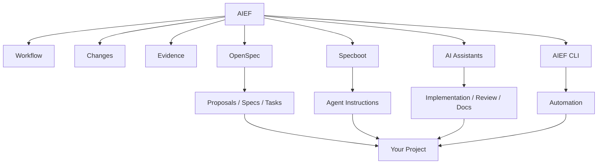

# AIEF

> **Coordinate humans, AI assistants, specifications, implementation and evidence in one simple workflow.**

AIEF is an orchestration layer for AI-assisted software engineering.

It does not replace your AI assistant.  
It does not replace OpenSpec.  
It does not replace Specboot.  

It coordinates them.

```text
Idea -> Change -> Spec -> Tasks -> Build -> Verify -> Evidence
```

---

## Why AIEF?

AI-assisted development can become messy quickly:

```text
Different prompts
Different assistant behavior
Unclear requirements
Untracked decisions
Missing evidence
Outdated documentation
```

AIEF gives teams a simple way to keep work consistent:

- every meaningful unit of work is a **Change**,
- every Change has a **specification**,
- every implementation has **tasks**,
- every completed Change has **evidence**,
- every AI assistant follows the same project rules.

---

## How AIEF fits with OpenSpec and Specboot



| Component | Purpose |
|---|---|
| **AIEF** | Coordinates the engineering workflow |
| **OpenSpec** | Helps create structured proposals, specs and tasks |
| **Specboot** | Helps bootstrap AI assistant instruction files |
| **AI assistants** | Help design, implement, review and document changes |
| **AIEF CLI** | Automates project, Change, status and release tasks |

---

## Start here

| I want to... | Go to |
|---|---|
| Understand AIEF | [Navigator](NAVIGATOR.md) |
| Decide what path to follow | [Decision Tree](docs/navigator/decision-tree.md) |
| Start a new project | [New Project](docs/navigator/new-project.md) |
| Adopt AIEF in an existing project | [Existing Project](docs/navigator/existing-project.md) |
| Use Windows, Linux or macOS | [Install Guides](docs/navigator/install) |
| Use AI assistants | [AI Assistants](docs/navigator/ai-assistants.md) |
| Use OpenSpec or Specboot | [Tooling](docs/navigator/tooling.md) |
| Learn by example | [Todo App Example](examples/todo-app/README.md) |

---

## Quick Start

### 1. Check your environment

```bash
node cli/bin/aief.js doctor
```

### 2. Create a new AIEF project

```bash
node cli/bin/aief.js init my-project
cd my-project
```

### 3. Create your first Change

```bash
node ../cli/bin/aief.js new-change add-login
```

This creates:

```text
changes/0001-add-login/
├── change.md
├── spec.md
├── tasks.md
└── evidence.md
```

### 4. Ask AI to help

```bash
node ../cli/bin/aief.js use-profile developer
```

Give your assistant:

```text
AGENTS.md
profiles/developer.md
changes/0001-add-login/
```

### 5. Verify the project

```bash
node ../cli/bin/aief.js status
node ../cli/bin/aief.js verify
```

---

## Using OpenSpec

If OpenSpec is installed, AIEF can delegate proposal creation to it.

```bash
node cli/bin/aief.js propose "Add login"
```

If OpenSpec is available, the CLI will attempt to call it.  
If not, AIEF creates a local Change skeleton and tells you what to do next.

AIEF remains usable even without OpenSpec.

---

## Using Specboot

Specboot is optional.

Use it when you want stronger multi-assistant instruction bootstrapping.

AIEF uses this hierarchy:

```text
AGENTS.md
  -> CLAUDE.md / GEMINI.md / CODEX.md / CURSOR.md
  -> profiles/
  -> active Change
```

`AGENTS.md` remains the source of truth.

---

## Repository structure

```text
.
├── README.md
├── NAVIGATOR.md
├── AGENTS.md
├── CLAUDE.md
├── GEMINI.md
├── CODEX.md
├── CURSOR.md
├── cli/
├── docs/
├── specs/
├── templates/
├── starter-project/
├── examples/
├── profiles/
├── adapters/
├── changes/
└── releases/
```

---

## Example

Run the executable Todo App example:

```bash
cd examples/todo-app
npm test
```

Expected result:

```text
3 tests pass
```

The example includes:

```text
specification
tasks
source code
tests
evidence
```

---

## CLI

```bash
node cli/bin/aief.js help
node cli/bin/aief.js doctor
node cli/bin/aief.js status
node cli/bin/aief.js init my-project
node cli/bin/aief.js new-change add-login
node cli/bin/aief.js propose "Add login"
node cli/bin/aief.js verify
node cli/bin/aief.js release 0.1.0
```

Optional local alias:

```bash
alias aief="node /path/to/aief-next/cli/bin/aief.js"
```

---

## Core idea

AIEF is built around one concept:

> **Think in Changes.**

A Change is any meaningful unit of engineering work:

- feature,
- bug fix,
- refactor,
- documentation update,
- research spike,
- release preparation.

Every Change should be understandable, actionable and verifiable.

---

## Status

AIEF is currently a starter framework and CLI MVP.

Recommended versioning:

```text
v0.1.0 = first usable starter release
v0.2.0 = validation from real existing project adoption
v1.0.0 = stable public release
```

---

## License

MIT.
