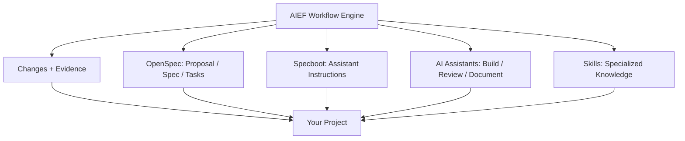

# AIEF — AI Engineering Workflow Engine

[](https://github.com/avazquezmaza/aief-next/actions/workflows/ci.yml)

> **Coordinate humans, AI assistants, specifications, implementation and evidence in one simple workflow.**

AIEF is not another spec generator and not another prompt library. It is the **workflow engine** that keeps AI-assisted engineering consistent, in three levels:

```text
1 · Context     (AIEF)                 doctor -> adopt -> verify -> analyze -> prompt
2 · Feature     (assistant + OpenSpec) Explore -> Propose -> Apply -> Archive
3 · Governance  (AIEF)                 verify -> close
```

Full picture: [The AIEF Workflow](docs/Workflow.md).

---

## The problem

AI-assisted development gets messy fast:

- every developer prompts differently,
- requirements live in chat histories,
- decisions go untracked,
- "done" has no evidence,
- documentation drifts.

AIEF fixes this with one rule — **think in Changes** — and a CLI that guides you through it:

- every meaningful unit of work is a **Change**,
- every Change has a **specification** and **tasks**,
- every completed Change has **evidence**,
- every AI assistant follows the same project rules (`AGENTS.md`).

AIEF orchestrates — it does not replace your AI assistant or your spec tooling. Everything else (OpenSpec, Specboot, Skills) is optional and explained [further down](#how-aief-fits-with-openspec-and-specboot).

---

## Get the CLI

Requires Node >= 18. No dependencies.

```bash
git clone https://github.com/avazquezmaza/aief-next.git
cd aief-next/cli
npm link        # installs a global `aief` command
```

Prefer not to link? Run it directly: `node cli/bin/aief.js <command>`.

## Adopt AIEF in an existing project (primary use case)

From your project's root:

```bash
aief doctor      # inspect environment and project readiness — writes nothing
aief adopt       # add the AIEF workflow — never touches application code
aief verify      # check the AIEF structure
aief analyze     # create an Analysis Change (analysis only, no code changes)
aief prompt claude --profile architect   # or: gemini, codex, cursor
```

What each step does:

1. **doctor** — checks git/node/npm/OpenSpec availability, detects your stack (with reasons) and recommends Skills.
2. **adopt** — creates `AGENTS.md` (if missing), `changes/`, `knowledge/`, starter **project standards** under `knowledge/standards/` matched to your stack, and an adoption Change using the next free ID. Idempotent; never overwrites; safe to re-run.
3. **verify** — confirms required files and Change structures; warns about placeholder evidence.
4. **analyze** — creates an Analysis Change **seeded with everything doctor detected**: signals, recommended Skills, available standards, inferred risks (marked as inference) and open questions.
5. **prompt** — prints a ready-to-paste prompt for your assistant, scoped to the active Change, including your project standards and the recommended Skills as context. Pass the assistant directly (`aief prompt gemini`) or with the long form (`--assistant gemini`); unknown values fail with guidance instead of silently falling back.

After adoption you will typically have two Changes: `0001-adopt-aief` and the Analysis Change. That is correct — the Analysis Change becomes the active one automatically, and the adoption Change can be closed before or after it (`aief close --yes --change adopt-aief`). The order does not affect AIEF.

Paste the generated prompt into your assistant and let it work inside the Change. When it finishes, run `aief verify`, then close the cycle:

```bash
aief close        # readiness report: files, tasks, evidence
aief close --yes  # marks the Change as Closed in change.md
```

## Start a new project

```bash
aief init my-project
cd my-project
aief new-change add-login
aief prompt claude
```

Every Change gets this skeleton:

```text
changes/0001-add-login/
├── change.md      # why and what
├── spec.md        # requirements and acceptance criteria
├── tasks.md       # implementation checklist
└── evidence.md    # what actually happened, verified
```

## Guarantees

- `doctor`, `status`, `prompt` and `verify` **never write files**. `close` writes one thing only — a `Status` section in `change.md` — and only with `--yes` after all readiness checks pass.
- `adopt` and `analyze` **never modify application code** — they only add AIEF workflow files.
- `adopt` never collides with existing Changes and is idempotent.
- The Change files are the **only source of truth** — no hidden state files; the active Change is simply the latest one not marked Closed (override with `--change`).
- OpenSpec and Specboot are **optional**; the CLI works without them and announces any fallback explicitly (never silently).
- Skill recommendations always **explain why** they fired.
- Every command explains itself: `aief help <command>` shows purpose, when to use it, what it reads, what it writes, an example and the next step.

## Commands

```bash
aief help [command]   # self-documenting help for every command
aief doctor           # environment + project readiness
aief status           # adoption status and recent Changes
aief adopt            # adopt AIEF in an existing project
aief analyze          # create an Analysis Change
aief new-change <name>
aief propose "<idea>" # delegates to OpenSpec when available
aief prompt [claude|gemini|codex|cursor] [--profile architect] [--change id]
aief verify           # check AIEF structures
aief close [--yes]    # readiness checks; --yes marks the Change Closed
aief init <name>      # new AIEF project
aief release <version>
```

Full reference: [docs/cli.md](docs/cli.md).

## Project standards and Skills

Two kinds of knowledge feed your assistant's prompts:

- **Project standards** live in `knowledge/standards/` (base, documentation, testing, security — plus frontend/backend when detected). `aief adopt` creates them as editable starting points with `(adapt)` markers; they are *your project's* rules, and `aief prompt` tells the assistant to follow them.
- **Skills** are specialized knowledge per technology or domain (multitenancy, n8n, AWS, RBAC…). They live in the catalog ([cli/src/skills-catalog.json](cli/src/skills-catalog.json)) and are recommended when their detection signals fire. `aief prompt` includes their context and common risks — as context for the assistant, never as something AIEF "executes".

Neither replaces `AGENTS.md`, which stays at the top of the instruction hierarchy.

## How AIEF fits with OpenSpec and Specboot

Both are optional. AIEF orchestrates; it does not replace your tools.

| Component | Responsibility |
|---|---|
| **AIEF** | Workflow orchestration: Changes, verification, evidence, adoption |
| **OpenSpec** *(optional)* | Proposal / Spec / Tasks generation |
| **Specboot** *(optional)* | Assistant instruction bootstrapping |
| **AI assistants** | Analysis, implementation, review, documentation |
| **Skills** | Specialized technology knowledge |

Instruction hierarchy — `AGENTS.md` is always the source of truth:

```text
AGENTS.md -> assistant file (CLAUDE.md, GEMINI.md, ...) -> profile -> skill -> active Change
```



- `aief propose "Add login"` validates the OpenSpec contract at runtime (installed? version? `propose` exposed?) and delegates when possible. On any failure it says so and creates a local Change instead. Details: [adapters/openspec/](adapters/openspec/README.md).
- Specboot's ideas (instruction hierarchy, profiles) are integrated conceptually via [adapters/specboot/](adapters/specboot/README.md) and [templates/specboot/](templates/specboot/).

## Tests and validation

```bash
cd cli && npm test               # CLI test suite (node --test, no dependencies)
cd examples/todo-app && npm test # executable example (3 tests)
node cli/bin/aief.js verify      # validate this repository's own AIEF structure
```

CI runs all three on every push and pull request ([.github/workflows/ci.yml](.github/workflows/ci.yml)).

## Learn more

| I want to... | Go to |
|---|---|
| Understand AIEF step by step | [Navigator](NAVIGATOR.md) |
| Decide what path to follow | [Decision Tree](docs/navigator/decision-tree.md) |
| Adopt AIEF in an existing project | [Existing Project Guide](docs/navigator/existing-project.md) |
| Start a new project | [New Project Guide](docs/navigator/new-project.md) |
| Install on Windows, Linux or macOS | [Install Guides](docs/navigator/install) |
| Learn by example | [Todo App Example](examples/todo-app/README.md) |
| Understand the architecture decisions | [Decision Log](knowledge/decisions.md) |
| See how AI assistants must behave | [AGENTS.md](AGENTS.md) |

## Status and roadmap

AIEF is in **Phase 2 — Validation** ([roadmap](docs/roadmap.md)): the framework, CLI and tests exist; the current goal is validating adoption on real existing projects and improving only from observed evidence.

Short roadmap:

1. Validate `aief adopt` + `analyze` on a real existing project.
2. Validate the OpenSpec integration against a real release.
3. First public release.
4. Then: npm package, GitHub Action, more Skills.

Progress is tracked as Changes in [changes/](changes/) — the repository uses its own workflow.

## License

MIT — see [LICENSE](LICENSE).
