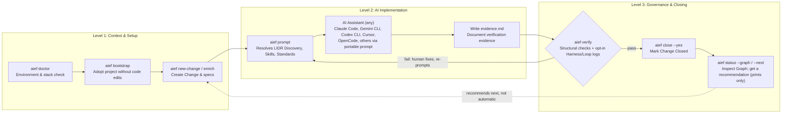

# AIEF — Assistant-Agnostic AI Engineering Workflow Engine

[](https://github.com/avazquezmaza/aief-next/actions/workflows/ci.yml)
[](LICENSE)

**AIEF coordinates humans, AI assistants, specifications, implementation and evidence in one
visible workflow.** It orchestrates the tools you already use — OpenSpec, SpecBoot-style
conventions, Claude, Gemini, Codex, Cursor — it does not replace any of them.

## What is AIEF?

AIEF is a **workflow engine** for AI-assisted software engineering: a dependency-free Node.js CLI
(`aief`) plus a set of visible conventions (`AGENTS.md`, `changes/`, `knowledge/`) that keep work
consistent no matter which AI assistant does the implementation.

One rule drives everything — **think in Changes**:

- every meaningful unit of work is a **Change**, a plain directory of Markdown files;
- every Change has a **specification** and a **task checklist**;
- every completed Change has **evidence** — no evidence, not done;
- every AI assistant follows the same project rules (`AGENTS.md`), whichever one you use.

## What problem does it solve?

AI-assisted development gets messy fast: every developer prompts differently, requirements live in
chat histories, decisions go untracked, "done" has no proof, and documentation drifts. Assistants
are excellent at implementing and forget everything the moment the session ends.

AIEF fixes the process, not the assistant: it prepares the context, composes the prompt, and
governs the evidence — so the same engineering discipline survives across assistants, sessions, and
teammates.

AIEF deliberately does **not**:

- generate proposals, specs, or task content — OpenSpec (or you) does that;
- implement, refactor, test, or review code — your AI assistant does;
- depend on any specific assistant — Claude, Gemini, Codex, Cursor, and future ones are all equal;
- keep hidden state — the Change files on disk are the only source of truth;
- create commits, publish PRs, or approve releases — humans decide.

## How does it work?


<details>
<summary>Canonical Mermaid Workflow Source</summary>


```mermaid
flowchart LR
    subgraph L1["Level 1: Context & Setup"]
        direction TB
        A["aief doctor<br/>Environment & stack check"] --> B["aief bootstrap<br/>Adopt project without code edits"]
        B --> C["aief new-change / enrich<br/>Create Change & specs"]
    end

    subgraph L2["Level 2: AI Implementation"]
        direction TB
        D["aief prompt<br/>Resolves LIDR Discovery, Skills, Standards"] --> E["AI Assistant (any)<br/>Claude Code, Gemini CLI, Codex CLI, Cursor,<br/>OpenCode, others via portable prompt"]
        E --> F["Write evidence.md<br/>Document verification evidence"]
    end

    subgraph L3["Level 3: Governance & Closing"]
        direction TB
        G{"aief verify<br/>Structural checks + opt-in Harness/Loop logs"}
        G -->|fail: human fixes, re-prompts| D
        G -->|pass| H["aief close --yes<br/>Mark Change Closed"]
        H --> I["aief status --graph / --next<br/>Inspect Graph; get a recommendation (prints only)"]
    end

    C --> D
    F --> G
    I -.->|recommends next, not automatic| C
```
</details>

Harness/Hooks, Loop verify-feedback, and the Change Graph are cross-cutting, **opt-in per Change**
capabilities layered on top of this flow — none of them ever blocks `verify`/`close`, and
`status --next`'s recommendation is always printed for a human to act on, never executed
automatically. Full detail: [docs/workflow.md](docs/workflow.md) and
[docs/architecture.md](docs/architecture.md).

Every Change gets this skeleton:

```text
changes/0001-add-login/
├── change.md      # why and what
├── spec.md        # requirements and acceptance criteria
├── tasks.md       # implementation checklist
└── evidence.md    # what actually happened, verified
```

AIEF's own responsibility ends at **context and governance** — it prepares the prompt and checks
the outcome; the engineering itself happens in your assistant, optionally structured by OpenSpec.
Full model, including how a Change can opt into staged tracks and gates, requirement sources
(Jira/manual), Skills, and evidence-based Requirement Verification: [docs/workflow.md](docs/workflow.md).

## Install

Requires Node.js >= 18. No runtime dependencies.

```bash
git clone https://github.com/avazquezmaza/aief-next.git
cd aief-next
npm install     # nothing to download; validates the package
npm link        # installs a global `aief` command
aief --help
```

Full install steps and a first-Change walkthrough: [docs/getting-started.md](docs/getting-started.md).

## Use it

```bash
aief doctor                              # environment + project readiness
aief bootstrap                           # adopt AIEF in the current project (existing project)
aief new-change add-login                # create a Change
aief prompt claude --profile developer   # generate a context-complete prompt for your assistant
aief verify                              # check structure and evidence
aief close --yes                         # mark the Change Closed
```

Not sure what to do next for a given Change? `aief status --next` answers that directly. Full
command and flag reference: [docs/cli.md](docs/cli.md).

## Extend it

- Attach a registered **Skill** to a prompt: `aief prompt --skill <id>` (list them with
  `aief prompt --list-skills`).
- Opt a Change into staged **tracks and gates**: add `manifest.json` with a `track`
  (`lite`/`standard`/`governed`) — see [docs/configuration.md](docs/configuration.md).
- Run evidence-based **Requirement Verification**: `aief verify --change <id> --requirements`.
- Add your own Skill, Hook, Verification Rule, or SDD provider: [docs/maintainer.md](docs/maintainer.md).

## Documentation

| I want to... | Go to |
|---|---|
| Get from zero to a verified Change | [Getting Started](docs/getting-started.md) |
| Learn the vocabulary (Change, Track, Gate, SDD Provider, Skill, Hook, Verification Rule) | [Concepts](docs/concepts.md) |
| Understand the full lifecycle, tracks, and verification model | [Workflow](docs/workflow.md) |
| Understand the implemented architecture | [Architecture](docs/architecture.md) |
| Look up a CLI command or flag | [CLI Reference](docs/cli.md) |
| Find every configuration file AIEF reads | [Configuration](docs/configuration.md) |
| See worked examples | [Examples](docs/examples.md) |
| Extend AIEF or contribute a Change | [Maintainer Guide](docs/maintainer.md) |
| Read the architecture decision log (ADRs) | [knowledge/decisions.md](knowledge/decisions.md) |
| Browse engineering history and superseded proposals | [docs/history/](docs/history/README.md) |

Recommended reading order: this README → [Getting Started](docs/getting-started.md) →
[Concepts](docs/concepts.md) → [Workflow](docs/workflow.md) → [Architecture](docs/architecture.md) →
[CLI Reference](docs/cli.md) → [Examples](docs/examples.md). Everything else is optional.

## How AIEF relates to OpenSpec, SpecBoot, and assistants

All integrations are optional. AIEF works standalone and announces every fallback explicitly —
never silently.

| Component | Responsibility |
|---|---|
| **AIEF** | Workflow, context, prompt composition, evidence, verification, Change lifecycle, adoption |
| **OpenSpec** *(optional)* | Proposal / Specification / Tasks |
| **SpecBoot** *(conceptual source)* | Inspiration for standards and instruction hierarchy — integrated as concepts, never copied |
| **AI assistant** *(any)* | Implementation, refactoring, code generation, tests, review |
| **Humans** | Scope, trade-offs, architecture decisions, release readiness |

Details and adapters: [adapters/openspec/](adapters/openspec/README.md),
[adapters/specboot/](adapters/specboot/README.md).

## Assistant compatibility

AIEF is **assistant-agnostic by contract, not just by intent**: `AGENTS.md` is the one universal
instruction file every `aief prompt` output tells the assistant to read first, and it is generated
identically regardless of which assistant (if any) you name. An assistant-specific file
(`CLAUDE.md`, `GEMINI.md`, `CODEX.md`, `CURSOR.md`) only ever *adapts format* — tone, emphasis,
how to phrase the same rules — never a contradictory engineering rule; `aief bootstrap` never
creates any of them, so a project with none of these files still gets a complete, working prompt.
`aief prompt` (no assistant name) is the fully generic form: AGENTS.md plus Change context, Skills
and Standards, with no assistant file included.

Verified by running `aief prompt <name>` for each row below in a from-scratch scratch project
(evidence: `changes/0060-*/evidence.md`) — never by invoking any assistant's own API or network
service:

| Assistant | Compatibility | Mechanism | Instruction file | Recommended command | Limitations |
|---|---|---|---|---|---|
| Claude Code | Native target | `aief prompt claude` includes the assistant file when present | `CLAUDE.md` | `aief prompt claude` | None found; falls back to AGENTS.md-only if `CLAUDE.md` is absent |
| Gemini CLI | Native target | `aief prompt gemini` includes the assistant file when present | `GEMINI.md` | `aief prompt gemini` | Same fallback as above |
| Codex CLI | Native target | `aief prompt codex` includes the assistant file when present | `CODEX.md` | `aief prompt codex` | Same fallback as above |
| Cursor | Native target | `aief prompt cursor` includes the assistant file when present | `CURSOR.md` | `aief prompt cursor` | Same fallback as above |
| OpenCode | Generic prompt compatible | `aief prompt` (no assistant name) — `opencode` is not a recognized positional value | `AGENTS.md` only | `aief prompt` | No dedicated `OPENCODE.md` adapter yet; works because the generic prompt is a complete, portable engineering contract |
| Continue, GitHub Copilot Chat, and other prompt-driven assistants | Generic prompt compatible, not validated natively | Same generic `aief prompt` output, pasted manually | `AGENTS.md` only | `aief prompt` | Not exercised against these tools in this repository's evidence; the contract is the same as OpenCode's row |

Naming an assistant `aief` doesn't recognize (`aief prompt <unknown>`) is a hard, loud error
listing the known names — never a silent fallback to the generic form. Full flag reference:
[docs/cli.md](docs/cli.md#assistants).

## Contributing

Every unit of work in this repository is itself an AIEF Change — see
[docs/maintainer.md](docs/maintainer.md) for the contribution workflow, how to add a Skill, Hook,
Verification Rule, or provider, and the documentation rules that keep this set small. Please open
an issue before major changes ([CONTRIBUTING.md](CONTRIBUTING.md)).

## Status

The CLI, its Core 3.0 subsystems (Change Manifest, Workflow Engine, SDD Provider, Skills Runtime,
Hooks Runtime, Verification Engine) and its AIEF 3.1 additions (Bootstrap, LIDR Discovery, Skills
and Standards precedence, Harness/Hooks visibility, Loop verify-feedback, the Change dependency
Graph, and Smart Workflow's `status --next`), and the test suite are implemented and validated on
real projects. Progress is tracked as Changes in [changes/](changes/) — that history **is** the
project's roadmap; each closed Change records what it delivered.

## License

MIT — see [LICENSE](LICENSE).
