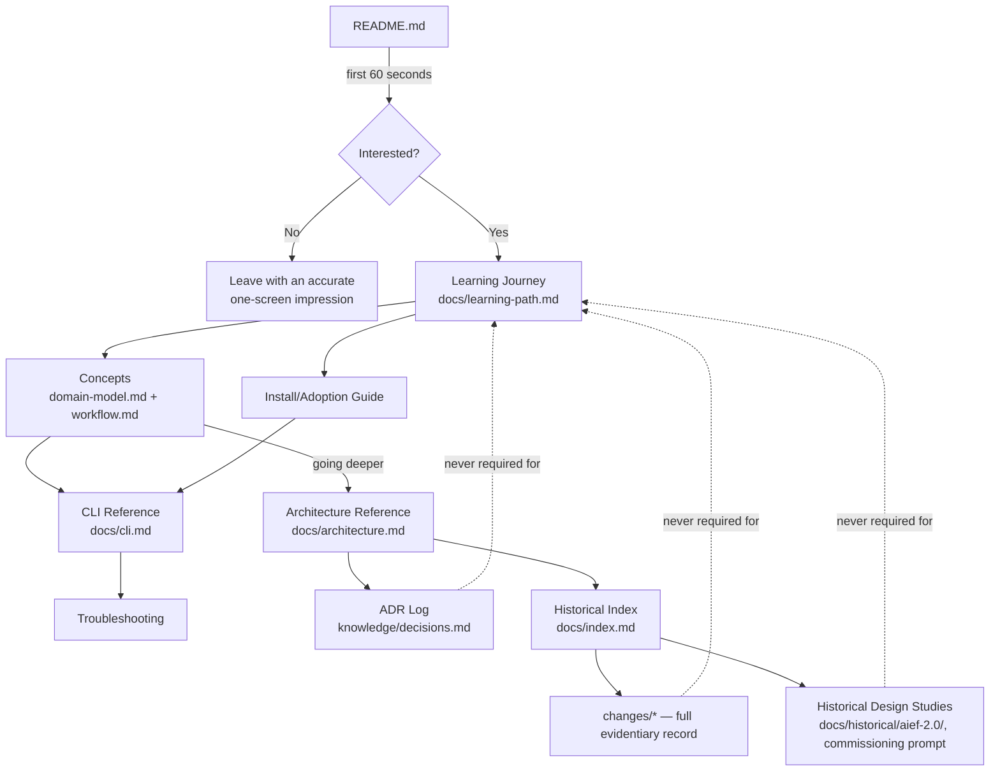

# Design — Core 3.0 Documentation Information Architecture

> **Supersedes the previous iteration of this file.** An earlier pass at Change 0050 (preserved in
> git history) approached this as a flat 382-file inventory + a single new "System Map" document. A
> revised commissioning instruction reframed the Change explicitly as **information architecture**:
> not a file inventory, not a rewrite, not a System Map draft — the documentation *system* Core 3.0
> needs, designed from the product model outward. This file replaces the prior design with that
> reframing. The prior inventory's factual findings (file counts, grep-confirmed staleness) are
> reused as evidence below where still relevant; its System Map draft and two-layer model are not
> carried forward as the target shape — Deliverable 5 proposes a different, audience-driven hierarchy.

---

## 1. Executive Decision

AIEF Core 3.0 shipped seven real subsystems (Change Manifest, Workflow Engine, SDD Provider, User
Workflow, Skills Runtime, Hooks Runtime, Verification Engine — Changes 0043–0049, all closed) on top
of a pre-existing product (AIEF 1.x) that already had ~114 documentation files describing it. Exactly
four of those files mention Core 3.0 at all (`docs/architecture.md`, `docs/domain-model.md`,
`knowledge/decisions.md`, `docs/aief-core-3-claude-code-prompt.md` — grep-confirmed). This is not a
volume problem and not primarily a quality problem — the existing docs that do exist are mostly
internally accurate for what they claim to cover. It is an **information architecture problem**: no
document tells a new engineer that Core 3.0 exists, no single set of documents has a clean
one-concept-one-owner mapping, and three separate historical/proposal bodies of writing (AIEF 2.0
design study, the original Core 3.0 commissioning prompt, and pre-2.0 roadmap material) sit at the
same folder depth as current product documentation with no structural signal distinguishing them.

This Change designs the target architecture and the Change 0051 blueprint to build it. It does not
touch a single existing documentation file.

## 2. Architecture Skill Used

**Discovery performed first, per instruction.** The full list of skills available in this
environment was inspected (`graphify`, `dataviz`, `artifact-design`, `artifact-capabilities`,
`update-config`, `keybindings-help`, `simplify`, `fewer-permission-prompts`, `loop`, `schedule`,
`claude-api`, `run`, `init`, `review`, `security-review`). **None of these is an Information
Architecture, Documentation Architecture, Software Architecture, System Architecture, or Technical
Documentation skill.** `init` scaffolds a new `CLAUDE.md`; `review`/`security-review` review code
changes and PRs; none apply to designing a documentation system.

**Conclusion: no dedicated skill is available in this environment.** Per the commissioning
instruction, this is explicitly not a blocker. This design instead applies the structured
architecture-review method the instruction specifies directly:

| Method element | Where applied in this design |
|---|---|
| System boundaries | §9 (Required Architectural Analysis), separating product/user documentation from internal engineering documentation, and current behavior from historical rationale |
| Responsibility ownership | Deliverable 4 (Concept Ownership Matrix) — one owner per concept, no exceptions |
| Separation of concerns | Deliverable 3 — every canonical document's single responsibility and explicit exclusions |
| Dependency direction | §9 — canonical docs may link *toward* architecture/history; history must never be a prerequisite for using the product |
| Information discoverability | Deliverable 5 (navigation rules, breadcrumbs, Current/Historical visual distinction) |
| Conceptual cohesion | Deliverable 2 (classification model) and Deliverable 1 (audience model), checked against each other for overlap |
| Canonical source ownership | Deliverable 4, cross-checked against Deliverable 3 (every canonical owner in Deliverable 3 must also be the Deliverable 4 owner for its concepts — verified, §14) |
| Audience-oriented navigation | Deliverable 1 and Deliverable 6 (learning journeys), built around who is reading, not where files happen to sit |

This method materially changed the output from the prior iteration of this Change: the earlier pass
organized around "what files exist" (a 382-file inventory); this pass organizes around "what a reader
in a given role needs to be able to do," and only then asks which existing files can serve that need.
The Concept Ownership Matrix (Deliverable 4) in particular would not exist under a file-first method
— it exists because responsibility-ownership analysis requires enumerating *concepts* independently
of documents first, then mapping onto documents second, catching two real multiple-owner conflicts
(§Deliverable 4 rows for "Workflow" and "Verification") that a file-by-file audit alone did not
surface as clearly in the prior iteration.

## 3. Evidence and Ground Truth

Ground truth for "what Core 3.0 actually is" was established by reading Changes 0043–0049 in full
(`proposal.md`/`design.md`/`spec.md` where present) and `knowledge/decisions.md` (ADR-016–021), then
cross-checking `docs/architecture.md` against that evidence rather than trusting it by default, per
instruction.

**Confirmed CLI surface** (`cli/src/cli.js` dispatcher): `help, --version, explain, doctor, status,
adopt, analyze, init, new-change, enrich, propose, prompt, close, use-profile, verify, release`. No
new command verb was added across Entregas 1–7 — ADR-015 (AIEF 2.0 usability-study freeze on new
commands) was honored throughout; every Core 3.0 capability landed as an **additive, opt-in flag**:
`status --change <id>`, `status --next`, `prompt --skill <id>`, `prompt --list-skills`, `verify
--requirements`.

**Per-Entrega ground truth** (Change → subsystem → key concepts/files):

| Change | Subsystem | Key concepts | Key paths |
|---|---|---|---|
| 0043 | Change Foundation | Optional `manifest.json`, unified loader (manifest-or-legacy) | `cli/src/core/domain/change-manifest.js`, `change-loader.js` |
| 0044 | Workflow Engine | `track` (lite/standard/governed), Gate, Stage, `resolveState()` | `cli/src/core/domain/workflow-definition.js`, `gate-evaluator.js`, `transition-engine.js`, `cli/src/workflows/*.json` |
| 0045 | SDD Provider | Provider abstraction (local/OpenSpec), normalized artifact states | `cli/src/core/domain/sdd-provider-resolver.js`, `cli/src/sdd-providers/{local,openspec}.js` |
| 0046 | User Workflow | `workflow-service.js` — `inspect()`/`nextAction()`/`canTransition()`/`explain()`, Normalized Action contract | `cli/src/core/services/workflow-service.js` |
| 0047 | Skills Runtime | Skill (versioned, capability-gated) — distinct from the pre-existing Skill *Catalog* (ADR-010) | `cli/src/skills/*.js`, `skill-context.js`, `skill-service.js` |
| 0048 | Hooks Runtime | Hook (closed event catalog: `prompt.prepared`, `verify.completed`, post-phase only) | `cli/src/hooks/*.js`, `hook-context.js`, `hook-service.js` |
| 0049 | Verification Engine | Structural Verification (existing, unchanged) vs. Requirement Verification (new, evidence-grounded) | `cli/src/verification-rules/*.js`, `verification-context.js`, `verification-service.js` |

**Repository facts distinguished from interpretation (per instruction):**

- **Fact**: `changes/0049-core3-verification-engine/change.md` records **Status: Closed (2026-07-27)**.
- **Fact**: `knowledge/decisions.md`'s ADR-021 header simultaneously reads **"Status: Proposed
  (2026-07-26), pending project-owner review."**
- **Interpretation**: this is a stale ADR status marker, not a real architectural contradiction — the
  Change closed the day after the ADR record shows "Proposed," and no later edit updated the ADR
  header. **Unresolved decision requiring human input** (not resolved by this Change): update
  ADR-021's status line to Accepted, or treat Entrega 7 as provisionally shipped pending formal ADR
  sign-off. Flagged again in §14 (Risks).
- **Fact**: `docs/cli.md` contains zero occurrences of `--change`, `--next`, `--skill`,
  `--list-skills`, or `--requirements` (grep-confirmed against the current file).
- **Fact**: `README.md`'s "Current Status" section states an "AIEF 2.0 baseline — frozen" framing and
  does not mention Entregas 1–7 anywhere in the file.
- **Fact**: `docs/aief-2.0/README.md` self-declares "Design study. No implementation... Status:
  Proposal. Not accepted, not authorized," governed by Change 0037 and frozen per ADR-015 — confirmed
  by direct read, not inferred from its folder name.
- **Fact**: `docs/aief-core-3-claude-code-prompt.md` is written in Spanish and describes a
  materially larger surface (new commands `start/work/next/review`, YAML manifests, executable
  `skill.yaml` checks, a conversational NL layer) than what Changes 0043–0049 actually implemented.
  It is the commissioning brief, not an as-built description — confirmed by comparing its content
  against the CLI surface fact above.

## 4. Core 3.0 Product Documentation Model (Deliverable 1)

Eight audiences were evaluated against the actual product surface. Two pairs overlap enough to share
a document; the rest need a distinct primary home (though not necessarily a distinct *file* — see
Deliverable 3 for where responsibilities land).

| Audience | What they need | Distinct surface needed? |
|---|---|---|
| **First-time evaluator** (deciding whether to adopt AIEF at all) | Elevator pitch, what problem it solves, 10-minute proof it works | Yes — needs to be *short*; overlaps with New User's first page but must stop before install detail |
| **New user** (adopting, first Change) | Install, first Change walkthrough, core concepts | Yes — the Learning Journey (Deliverable 6) is built for this audience specifically |
| **Active user** (day-to-day, already onboarded) | CLI reference, workflow/track semantics, troubleshooting | Yes — reference-mode reading (lookup, not linear), materially different usage pattern from New User's linear read |
| **Project adopter** (bringing AIEF into an existing codebase) | Adoption flow (`aief adopt`, `analyze`), SDD provider choice | **Shares** a document with Active User's CLI reference plus one adoption-specific guide already covering this narrowly (pre-existing content, not a new document) |
| **Contributor** (extending AIEF itself) | Architecture, domain model, how to add a Skill/Hook/Verification Rule | Yes — this is Architecture-classification territory, separate from user-facing docs |
| **Maintainer** (keeps docs/ADRs current) | Source-of-truth rules, ownership matrix, obsolescence triggers | Yes — this is exactly Deliverable 7; no other audience needs it |
| **Architect** (evaluating/extending the design) | Full architecture reference, ADR log, domain model | **Shares** its surface with Contributor — both read the same two documents (`architecture.md`, `domain-model.md`) plus the ADR log; the distinction is depth of engagement, not a different document |
| **Auditor / reviewer** | Evidence trail, Change history, ADR decisions, what shipped when | Yes — needs the Historical layer specifically (Change index, ADR log), and needs it presented as *complete*, not summarized away |

**Where audience needs overlap (no separate document created for these):**
- Architect and Contributor read the same architecture surface — one document set, not two.
- Project Adopter and Active User both need CLI/adoption reference — one document, not two.
- First-time Evaluator's need is a strict subset of New User's first five minutes — solved by making
  the entry point's first screen answer the Evaluator's question, not by a separate "pitch" document.

**Where a separate surface is required** (justified by usage-mode difference, not just topic):
New User needs *linear, ordered* reading (a journey); Active User needs *lookup* reading (a
reference). Same underlying facts, different information architecture — this is why Deliverable 3
keeps a Learning Journey document and a CLI Reference document separate even though they describe
overlapping ground.

## 5. Documentation Classification Model (Deliverable 2)

The brief's three-category model (Current / Reference / Historical) is retained — evidence does not
justify replacing it, only subdividing Current and Historical, since both currently blur two
genuinely different maintenance obligations.

### Current

- **Purpose**: defines, teaches, or references the product as it exists today, including Core 3.0.
- **Audience**: every audience in Deliverable 1 except Auditor.
- **Maintenance expectation**: updated as part of the Definition of Done for any Change that alters
  behavior it describes (Deliverable 7 rule) — this is the one category with an update *obligation*,
  not just a permission.
- **Mutability**: living; edited in place, no immutability constraint.
- **Discoverability**: must be reachable within two clicks/links from `README.md`.
- **Allowed content**: accurate description of shipped behavior, forward links to Reference/Historical
  for depth.
- **Prohibited content**: unshipped/aspirational features presented as available; Change/Entrega
  chronology as the organizing structure (violates "product-first organization").

  **Subcategories** (both needed — evidence: a New User's linear "Learning" need and an Active User's
  lookup "Concepts" need are genuinely different reading modes, confirmed in Deliverable 1):
  - **Current / Learning** — ordered, narrative, assumes nothing. Owns onboarding only.
  - **Current / Concepts** — the product's conceptual model (Workflow, Gate, SDD Provider, Skill,
    Hook, Verification), addressable individually, not read start-to-finish.

### Reference

- **Purpose**: supporting material that remains useful but is not part of the primary learning
  journey — CLI syntax, install steps per OS, configuration options, troubleshooting.
- **Audience**: Active User, Project Adopter, primarily lookup-mode reading.
- **Maintenance expectation**: updated when the thing it references changes (a CLI flag, an install
  step) — narrower obligation than Current, triggered by a specific event, not by general drift.
- **Mutability**: living, edited in place.
- **Discoverability**: reachable from Current documents via explicit "see the reference" links; not
  required to be reachable from the root within two clicks (it is not the onboarding path).
- **Allowed content**: exhaustive enumeration (every flag, every config key), example commands.
- **Prohibited content**: conceptual explanation duplicated from a Current/Concepts document (link
  instead); historical rationale for why a flag exists (belongs in the Change/ADR that added it).
  **No further subcategory is justified** — the evidence (cli.md, install docs, FAQ-shaped content)
  doesn't show two distinct usage modes within Reference the way Current does.

### Historical

- **Purpose**: preserved record of past decisions, investigations, Changes, ADRs, findings, or
  rejected/superseded designs.
- **Audience**: Auditor/reviewer primarily; occasionally Contributor/Architect researching precedent.
- **Maintenance expectation**: **none** — immutability is the point (Deliverable 7 rule: "Changes are
  immutable, ADRs are immutable").
- **Mutability**: frozen once accepted/closed. A correction is a new Change/ADR, never an edit.
- **Discoverability**: reachable via an index (Change index, ADR index — Deliverable 5), never
  presented at the same navigational level as Current documentation, and never required reading to
  use the product (this is the one rule the current repository violates hardest: nothing distinguishes
  `docs/aief-2.0/` from `docs/architecture.md` by folder depth alone).
- **Allowed content**: exactly what was decided/found/proposed, dated, attributed.
- **Prohibited content**: silent edits; being cited as the current state of anything without a
  cross-check against Current documentation.

  **Subcategories justified by evidence** (three genuinely different historical *kinds* were found,
  each with a different reader intent):
  - **Historical / Accepted Decisions** — the ADR log (`knowledge/decisions.md`). Read to understand
    *why* something is the way it is.
  - **Historical / Changes** — `changes/*` (all 50). Read to understand *what was built and verified,
    when*, with full evidentiary trail (`evidence.md`/`verification.md`).
  - **Historical / Design Studies** — `docs/aief-2.0/*` and `docs/aief-core-3-claude-code-prompt.md`.
    Read to understand *what was proposed but not built as proposed* — the evidence found this is a
    genuinely distinct reader intent from either of the other two (a reader here wants to know "was
    this idea considered and why didn't it ship this way," not "what decision governs today" or "what
    evidence closed this Change").

## 6. Canonical Product Surface (Deliverable 3)

12 canonical documents (within the 8–15 target). Each row states Change 0051's proposed action —
**no filenames are invented without justification; where an existing file already owns the
responsibility, it is kept or rewritten in place, not replaced by a new name.**

| # | Path / logical name | Purpose | Primary audience | Secondary audience | Owner | Classification | Responsibility | Exclusions | Inputs | Links to | Existing candidates | 0051 action |
|---|---|---|---|---|---|---|---|---|---|---|---|---|
| 1 | `README.md` | Answer "what is this, is it for me, where do I start" in one screen | First-time evaluator | New user | Product owner | Current | Pitch, current status (incl. Core 3.0), top nav | CLI syntax, architecture detail | Product state, CLI surface | Learning Journey, Concepts index | `README.md` (existing) | REWRITE |
| 2 | Learning Journey (single document) | One ordered path, first Change to first `verify` | New user | First-time evaluator (stops early) | Core maintainer | Current/Learning | Linear onboarding sequence, ~60 min | CLI exhaustive reference, conceptual depth beyond what's needed to act | README | CLI Reference, Concepts index | `docs/learning-path.md`, `docs/Getting-Started.md`, `docs/first-30-minutes.md`, `docs/index.md`, `docs/bootstrap.md` (existing, competing) | MERGE → REWRITE |
| 3 | Concepts (Core 3.0 + base model) | Address one concept at a time, lookup-mode | Active user, Contributor | Architect | Core maintainer | Current/Concepts | Workflow, Gate, Track, SDD Provider, Skill, Hook, Verification — one authoritative paragraph each with a link to full architecture | Full contracts/ADR text (link instead) | domain-model.md, architecture.md | Architecture (deep dive), CLI Reference | `docs/domain-model.md`, `docs/mental-model.md` (existing, partial overlap) | REWRITE (domain-model.md absorbs mental-model.md's onboarding framing) |
| 4 | Workflow (levels, tracks, gates) | The one authoritative description of how work is scaled and gated | Active user, New user | Contributor | Core maintainer | Current/Concepts | Context/Feature/Governance levels *and* track/gate mechanics as one coherent model | CLI flag syntax | architecture.md Entrega 2 section | CLI Reference | `docs/Workflow.md`, `docs/choosing-your-workflow.md`, `docs/lifecycle.md` (existing, currently split/stale) | REWRITE (absorb choosing-your-workflow.md's subject matter; lifecycle.md's stage table folds in) |
| 5 | CLI Reference | Exhaustive, current command/flag enumeration | Active user, Project adopter | New user (lookup) | Core maintainer | Reference | Every command and flag, including all five Core 3.0 additive flags | Workflow philosophy, conceptual explanation | cli.js, architecture.md per-Entrega CLI sections | Workflow, Concepts | `docs/cli.md` (existing) | REWRITE |
| 6 | Install / Adoption Guide | Get AIEF onto a machine and into an existing or new project | New user, Project adopter | — | Core maintainer | Reference | Install steps, `adopt`/`analyze` flow, SDD provider selection | Workflow/conceptual content | migration-guide.md, ecosystem.md | Learning Journey, CLI Reference | `docs/navigator/install/*`, `docs/migration-guide.md`, `docs/ecosystem.md` (existing ladder, currently triplicated — see Deliverable 8) | MERGE → REWRITE |
| 7 | Troubleshooting / FAQ | Answer "why isn't this working / what does X mean" | Active user | New user | Core maintainer | Reference | Common failure modes, exit codes, gate/verdict meanings | Conceptual teaching (link to Concepts) | ci-gate.md, FAQ.md | Concepts, CLI Reference | `docs/FAQ.md`, `docs/ci-gate.md` (existing, thin) | REWRITE (expand) |
| 8 | Architecture Reference | Full implemented-architecture description, Entrega by Entrega, ADR-cited | Contributor, Architect | Auditor | Core maintainer | Current (engineering-facing) | Every subsystem's contracts, capability models, design rationale | Onboarding-level explanation (link to Concepts instead) | Changes 0043–0049, ADRs 016–021 | Concepts, ADR log | `docs/architecture.md` (existing, already current) | KEEP |
| 9 | Principles | Governing design principles | Contributor, Architect | Maintainer | Core maintainer | Current | Cross-cutting rules (no hidden state, evidence-driven, single responsibility, etc.) | Feature-specific behavior | ADR log | Architecture Reference | `docs/principles.md`, `docs/VISION.md` (existing, current) | KEEP |
| 10 | Assistant Operating Rules | What an AI assistant must/must not do inside a Change | AI assistants (all) | Contributor | Core maintainer | Current | Change/spec/evidence workflow contract | Product pitch, architecture | — | Learning Journey (for humans supervising an assistant) | `AGENTS.md` + thin per-assistant files (existing, current) | KEEP |
| 11 | Maintainer Guide | How to keep this documentation system itself correct | Maintainer | Core maintainer | Core maintainer | Current | Deliverable 7's rules, ownership matrix, obsolescence triggers | Product content | This Change's own Deliverable 4/7 | Everything (it's the meta-document) | *(new — no existing file owns this responsibility)* | CREATE |
| 12 | Historical Index (Changes + ADRs + Design Studies) | One navigable index into all three Historical subcategories | Auditor, Contributor (precedent research) | Architect | Core maintainer | Historical | Pointers only — id, title, Entrega/date, status, one-line summary, link | Full ADR/Change text (never reproduced) | changes/*, knowledge/decisions.md, docs/aief-2.0/* | Nothing (it's the leaf of the hierarchy) | *(new index; existing `docs/index.md`'s "Historical Reference" section is the nearest precedent)* | CREATE (extend `docs/index.md` rather than a new file — see Deliverable 8) |

**Documentation budget check**: 12 documents, each justified by a distinct responsibility or reader
usage-mode per Deliverable 1/2's analysis; none created merely because an audience exists (per the
brief's explicit instruction) — rows 3/4/6 each explicitly *absorb* narrower existing files rather
than adding new ones, keeping the count from growing past the merges it requires.

## 7. Concept Ownership Matrix (Deliverable 4)

| Concept | Canonical owner | Classification | Secondary mentions allowed in | Current duplication or gap | 0051 action |
|---|---|---|---|---|---|
| AIEF product overview | README.md | Current | Learning Journey (recap only) | None — README is uncontested as entry point | REWRITE |
| Core 3.0 | Architecture Reference (`architecture.md`) | Current | README (one paragraph), Concepts (per-subsystem paragraph) | **Gap**: only 4/~114 files mention it at all today | REWRITE (README, Concepts); KEEP (architecture.md already owns it) |
| Conceptual model | Concepts doc (`domain-model.md`) | Current | Architecture Reference (deeper), Workflow doc (its own slice) | None structural; content gap on Core 3.0 rows already closed in domain-model.md | KEEP |
| Change | Concepts doc | Current | Workflow doc, CLI Reference | None | KEEP |
| Change lifecycle | Workflow doc (`lifecycle.md`'s stage table absorbed) | Current | Learning Journey | Minor: `lifecycle.md` and `Workflow.md` currently split this concept across two files with no cross-reference | MERGE into Workflow doc |
| Change Manifest | Architecture Reference | Current (engineering) | Workflow doc (one paragraph: what `track` reads from it) | None | KEEP |
| Change selection (choosing a track/scale) | Workflow doc | Current | Learning Journey | **Gap/duplication**: `docs/choosing-your-workflow.md` currently owns this topic under pre-Core-3.0 framing (manual template copying) while the actual mechanism (`manifest.track`) is described only in architecture.md — two owners for one concept, neither cross-referencing the other | MERGE `choosing-your-workflow.md`'s subject into Workflow doc |
| Workflow levels (Context/Feature/Governance) | Workflow doc | Current | — | None | KEEP |
| Declarative workflow tracks (lite/standard/governed) | Workflow doc | Current | Architecture Reference (mechanics) | **Multiple-owner conflict found**: architecture.md describes tracks mechanically; Workflow.md (the doc that's supposed to be *the* workflow authority) doesn't mention tracks at all today. This is the ownership gap this matrix exists to catch. | REWRITE Workflow doc to absorb |
| Workflow stages | Workflow doc | Current | Architecture Reference | Same gap as above | REWRITE |
| Gates | Workflow doc | Current | Architecture Reference, Governance conventions doc | `docs/governance-conventions.md`'s `(human)`/`(review)` task-label convention is adjacent but distinct from the Workflow Engine's `Gate` object — currently unclarified whether they relate (they don't; both should say so) | REWRITE (Workflow doc adds the clarification; governance-conventions.md gets one cross-reference — REVIEW LATER, see Deliverable 8) |
| Actions and next-action derivation | Workflow doc | Current | CLI Reference (`status --next` syntax) | None once merged | REWRITE |
| Prompt Engine | Architecture Reference | Current (engineering) | CLI Reference (`prompt` syntax), Concepts (one paragraph) | **Architecture-only gap**: `docs/architecture.md` §"Prompt Engine and Context Composition" is the only place this concept is defined; no user-facing document explains what `aief prompt` assembles or why | ADD user-facing paragraph to Concepts (new content, Change 0051 phase 3) |
| Detection Engine | CLI Reference (`docs/cli.md` §"Detectors") | Reference | Architecture Reference | None found | KEEP |
| Standards | Architecture Reference (`architecture.md` §"Standards") | Current (engineering) | Concepts | **User-documentation gap**: standards affect what an assistant is told per-project, but no user guide explains how to author one | REVIEW LATER (candidate content gap, not urgent — flagged, not solved, in this Change) |
| Profiles | Architecture Reference + `profiles/` directory itself | Current (engineering) | Concepts, Install/Adoption Guide (`use-profile` flag) | None structural; `profiles/` usage was found low in a prior evidence pass — a content question, not an ownership question | KEEP |
| Skill Catalog (ADR-010, pre-existing) | Architecture Reference §"Skills" | Current | Concepts | **Terminology collision, resolved but fragile**: "Skill" names two different things (Catalog entries recommended by `recommendSkills()`, vs. Skills Runtime's versioned/capability-gated Skill, Entrega 5). `docs/domain-model.md` already disambiguates this explicitly — the *resolution* exists, but no user-facing document (Concepts, CLI Reference) repeats the disambiguation, so a user reading only `docs/cli.md`'s "Skill recommendations" section has no signal a second, different "Skill" exists | ADD one disambiguating sentence to CLI Reference and Concepts (Change 0051 content phase) |
| Skills Runtime | Architecture Reference §"Skills Runtime" | Current (engineering) | Concepts, CLI Reference (`--skill`/`--list-skills`) | **Gap**: no user-facing document describes what `prompt --skill` actually does today; `docs/cli.md` doesn't mention the flag at all | ADD to CLI Reference (Change 0051) |
| Hooks Runtime | Architecture Reference §"Hooks Runtime" | Current (engineering) | Concepts (brief — hooks are automatic/invisible by design) | **Gap**: zero user-facing mention anywhere; acceptable since Hooks are non-interactive by design, but Concepts should still name the mechanism exists (for Contributor audience specifically) | ADD one paragraph to Concepts |
| SDD Provider | Architecture Reference §"SDD Provider boundary" | Current (engineering) | Workflow doc, Install/Adoption Guide | **Multiple-owner-adjacent conflict**: `docs/ecosystem.md` and `docs/navigator/tooling.md`/`workflows.md`/`paths/*.md` (5 files) each independently describe an "AIEF + OpenSpec + SpecBoot" ladder that is, in substance, describing SDD Provider selection *without using that term* — none of them reference the Entrega-3 abstraction that now formally unifies this choice | MERGE the navigator ladder into Install/Adoption Guide; REWRITE to use SDD Provider terminology |
| Local SDD | SDD Provider's owner (Install/Adoption Guide, mechanics in Architecture Reference) | Current/Reference split | — | None beyond the ladder duplication above | Resolved by the MERGE above |
| OpenSpec integration | Same as SDD Provider row | Current/Reference split | `docs/ecosystem.md` | Same ladder duplication | Resolved by the MERGE above |
| Evidence | Architecture Reference §"Evidence" | Current (engineering) | Concepts, Assistant Operating Rules (`AGENTS.md` already covers evidence discipline for assistants) | None — AGENTS.md and architecture.md agree | KEEP |
| Structural Verification | Architecture Reference §"Verify"/"Verification internals" | Current (engineering) | CLI Reference, Troubleshooting | **Terminology collision, resolved in architecture.md, not propagated**: "Verification" alone is ambiguous between Structural (always-on) and Requirement (opt-in) since Entrega 7 split them. architecture.md's own section headers already disambiguate; CLI Reference and Troubleshooting do not yet | ADD disambiguating language to CLI Reference, Troubleshooting (Change 0051) |
| Requirement Verification | Architecture Reference §"Verification Engine — Entrega 7" | Current (engineering) | Same as above | Same collision; also the ADR-021-vs-Change-0049-status discrepancy noted in §3 | Same fix; separately, **human decision required** on ADR-021 status (§14) |
| Verification rules | Architecture Reference | Current (engineering) | — | None | KEEP |
| CLI commands | CLI Reference | Reference | README (list only, no detail) | None once cli.md is rewritten | REWRITE |
| CLI flags | CLI Reference | Reference | — | **Concrete gap, grep-confirmed**: `--change`, `--next`, `--skill`, `--list-skills`, `--requirements` appear in zero current occurrences of `docs/cli.md` | REWRITE |
| Installation and bootstrap | Install/Adoption Guide | Reference | README (one-liner) | Currently split across `docs/navigator/install/*` (3 near-identical per-OS files), `docs/bootstrap.md`, `README.md`'s own Install section — no single owner | MERGE |
| Adoption | Install/Adoption Guide | Reference | Workflow doc (`aief adopt` as a Change type) | Same merge as above | MERGE |
| Configuration | **No current owner** | Reference | — | **Gap, no ownership conflict — pure absence.** No document enumerates configuration surface (manifest fields, profile selection, standards files) in one place; scattered across cli.md, migration-guide.md, architecture.md | CREATE minimal Configuration section inside CLI Reference (not a 13th document — content, not architecture, gap) |
| Examples | `starter-project/`, `examples/` | Reference | Learning Journey (points at them) | Not independently re-audited this Change (explicit non-goal: no existing-doc rewrite); flagged for REVIEW LATER | REVIEW LATER |
| Troubleshooting | Troubleshooting/FAQ doc | Reference | CLI Reference | **Gap**: currently thin (6 short Q&As in FAQ.md); no dedicated troubleshooting content for gate/verdict-meaning confusion this matrix itself surfaces | REWRITE (expand) |
| Assistant operating rules | AGENTS.md | Current | Per-assistant thin files | None — already correctly single-owned | KEEP |
| Architecture decisions | `knowledge/decisions.md` (ADR log) | Historical/Accepted Decisions | Architecture Reference (cites, never restates) | The ADR-021/Change-0049 status mismatch (§3) | Human decision required (§14) |
| Change history | `changes/*` + Historical Index | Historical/Changes | — | No summarized index exists today (`docs/index.md` has a "Historical Reference" section for `specs/` only, not a full Change index) | CREATE Historical Index (extends docs/index.md) |

**Ownership audit result**: of 33 concepts evaluated, **2 had a genuine multiple-owner conflict**
(workflow tracks/stages — architecture.md vs. Workflow.md's silence; SDD Provider — 5+ navigator/
ecosystem files independently describing it without the term), **1 had a misleading-owner risk** (the
"Skill" naming collision — correctly resolved in domain-model.md but not propagated to user-facing
docs), **5 had architecture-only documentation with no user-facing counterpart** (Prompt Engine,
Skills Runtime's `--skill` flag, Hooks Runtime, Structural/Requirement Verification distinction,
Standards authoring), and **1 had no owner at all** (Configuration, a pure content gap, not a
conflict).

## 8. Target Information Architecture (Deliverable 5)

### 8.1 Tree view

```text
README.md                              (Current — entry point)
│
├── docs/
│   ├── learning-path.md               (Current/Learning — merged Learning Journey)
│   ├── concepts/                      (Current/Concepts)
│   │   ├── domain-model.md            (kept; absorbs mental-model.md)
│   │   └── workflow.md                (kept name Workflow.md; absorbs choosing-your-workflow.md,
│   │                                    lifecycle.md's stage table)
│   ├── cli.md                         (Reference — CLI + Configuration section)
│   ├── install.md                     (Reference — merged install/adoption/SDD-ladder)
│   ├── troubleshooting.md             (Reference — merged FAQ + ci-gate content)
│   ├── architecture.md                (Current, engineering-facing — Architecture Reference)
│   ├── principles.md                  (Current — kept)
│   ├── VISION.md                      (Current — kept)
│   ├── maintainer-guide.md            (Current — NEW, Deliverable 7's rules live here)
│   ├── index.md                       (Current — becomes the Historical Index + site map)
│   └── historical/                    (Historical — RELOCATE target, see Deliverable 8)
│       ├── aief-2.0/                  (Historical/Design Studies)
│       ├── aief-core-3-claude-code-prompt.md   (Historical/Design Studies)
│       └── roadmap-pre-core3/         (Historical/Design Studies — old roadmap.md/ROADMAP-TO-1.0.md
│                                        pending the human decision in §14)
│
├── knowledge/
│   └── decisions.md                   (Historical/Accepted Decisions — unmoved, unedited)
│
├── changes/                           (Historical/Changes — unmoved, unedited, all 50)
│
└── AGENTS.md, CLAUDE.md, CODEX.md, CURSOR.md, GEMINI.md   (Current — unmoved, unedited)
```

Note: this tree is the **target shape**, not a moved filesystem — Change 0050 relocates nothing;
Deliverable 8 maps every existing file to a target position, and Deliverable 9 sequences the actual
moves/rewrites as Change 0051 phases.

### 8.2 Reader-flow diagram



The dotted "never required for" edges encode the one non-negotiable dependency-direction rule from
§9: a new user's path (solid edges, top half) never passes through a Historical node. Historical
nodes are reachable only by descending *from* Architecture Reference, never a prerequisite to reach
it.

### 8.3 Navigation rules

1. Every Current document links **forward** (toward more depth) and **up** (back toward README) —
   never sideways into a same-depth competitor (this is the rule the current `README.md` /
   `docs/index.md` / `NAVIGATOR.md` / `docs/navigator/README.md` four-way overlap violates today).
2. A Historical document may link to another Historical document freely, and may be linked *from* a
   Current document (as a "see also, for history" pointer) — but a Current document must never
   require following a Historical link to complete its own stated purpose.
3. Exactly one document per classification tier is the designated entry point into that tier:
   `README.md` (Current), `docs/cli.md` (Reference lookup root — other Reference docs link from it,
   not the reverse), `docs/index.md` (Historical Index root).

### 8.4 Cross-linking rules

- A concept mentioned in passing links to its Deliverable-4 canonical owner on first mention per
  document — never redefined locally.
- Architecture Reference cites ADRs by number with a link; it never reproduces Decision/Context/
  Consequences text (this rule already holds today for `architecture.md` — preserve it).
- The Historical Index links to every Change and every ADR by id; nothing in `changes/` or
  `knowledge/decisions.md` is ever unreachable from it (satisfies "historical ≠ deleted").

### 8.5 Breadcrumb / section-context recommendations

Every Current and Reference document opens with a four-line header block (Purpose / Audience / Owner
/ Status — per the brief's Deliverable 7 requirement and this design's Deliverable 2 status values),
which doubles as a breadcrumb: a reader landing mid-document via search immediately sees which tier
they're in without needing folder-path context.

### 8.6 Preventing Current/Historical equivalence

The single highest-leverage structural fix: **relocate `docs/aief-2.0/` and
`docs/aief-core-3-claude-code-prompt.md` under a `docs/historical/` path** (Deliverable 8, RELOCATE
action). Today both sit at the same folder depth as `docs/architecture.md`, so folder-browsing alone
cannot distinguish "current, load-bearing architecture reference" from "frozen 2026-era design study
never authorized." Depth/path is the cheapest, most durable signal available in a
dependency-free, Markdown-only repository — no tooling is required to enforce it, unlike a status
banner (which can be missed) or a build-time check (which the project doesn't have and this Change
doesn't propose adding, per the brief's "dependency-free project" constraint in Deliverable 7).

## 9. Required Architectural Analysis (boundaries, cohesion, dependency direction, discoverability, terminology)

**Boundaries** — six specific ones evaluated:

- *Product vs. internal engineering documentation*: Architecture Reference is explicitly engineering-
  facing (Contributor/Architect); everything in the canonical surface's rows 1–7 (Deliverable 3) is
  product-facing. The boundary is the audience column, not a folder.
- *Current behavior vs. historical rationale*: enforced by the Historical relocation (§8.6) and the
  dependency-direction rule (§9, next bullet).
- *User workflow vs. internal implementation*: `workflow-service.js`'s `explain()` (Entrega 4) is the
  one seam every later Entrega (Skills Context, Hook Context, Verification Context) reuses rather than
  re-deriving — this is a code-level boundary the documentation should mirror: Concepts/Workflow doc
  describes the *user-visible* stage/gate/action model; Architecture Reference describes the
  `explain()` seam and its reuse. Conflating them (as `docs/Workflow.md` currently does by omission —
  describing levels but not the mechanism now driving them) is exactly the multiple-owner conflict
  Deliverable 4 flagged.
- *Conceptual model vs. command reference*: kept as two documents (Concepts vs. CLI Reference) per
  Deliverable 3 row 3 vs. row 5 — different usage mode (linear/lookup-by-concept vs. lookup-by-flag).
- *Skill Catalog vs. Skills Runtime*: a real, evidence-confirmed terminology collision (ADR-010's
  pre-existing "Skill" vs. Entrega 5's versioned Skill). `domain-model.md` already resolves it in
  writing; the fix this design proposes is **propagation**, not re-resolution — CLI Reference and
  Concepts each need the one disambiguating sentence domain-model.md already has.
- *Structural vs. Requirement Verification*: same pattern — resolved at the Architecture Reference
  layer (Entrega 7 ADR-021), not yet propagated to CLI Reference/Troubleshooting.
- *Broad workflow orchestration vs. declarative Workflow Engine subsystem*: "Workflow" names both the
  three-level product model (`docs/Workflow.md`, pre-Core-3.0) and the Entrega-2 Gate/Track engine
  (`architecture.md`). This design's resolution: **one document** (the merged Workflow/Concepts doc,
  Deliverable 3 row 4) owns both meanings explicitly, stating the relationship rather than letting two
  separate documents each describe half the picture with no cross-reference — this was the single
  clearest multiple-owner conflict found (Deliverable 4).

**Responsibility cohesion** — every canonical document in Deliverable 3 was checked against "does it
try to be tutorial + reference + troubleshooting simultaneously." The one document most at risk of
scope creep is the merged Install/Adoption Guide (row 6) — it absorbs three existing files
(`navigator/install/*`, `migration-guide.md`, `ecosystem.md`'s ladder). **Flagged explicitly**: this
merge must stay procedural (steps to run) and route any conceptual "why OpenSpec vs. local SDD"
explanation to the Concepts/Workflow doc — Change 0051's phase 2 rewrite must enforce this split
during the merge, not after.

**Dependency direction** — the one rule enforced structurally (§8.2's dotted edges, §8.6's
relocation): Historical material is never a prerequisite. Verified against every row in Deliverable 3
— no canonical document's "Inputs" column lists a Historical source as required reading; Historical
sources appear only in "Links to" columns, i.e., optional forward references.

**Discoverability** — checked against the four literal questions the brief poses for a root-landing
reader:
- *What is Core 3.0?* → currently unanswered by README (Deliverable 3 row 1's REWRITE fixes this).
- *Where to start?* → currently four competing candidates (`README.md`, `NAVIGATOR.md`,
  `docs/index.md`, `docs/navigator/README.md`); target design designates `README.md` alone, with
  `docs/navigator/*`'s OS/assistant-specific content absorbed into the Install/Adoption Guide
  (Deliverable 8) rather than remaining a parallel entry point.
- *Where does command reference live?* → `docs/cli.md`, uncontested once rewritten.
- *Where does architecture live?* → `docs/architecture.md`, uncontested today already.
- *Which content is historical?* → answered structurally by the `docs/historical/` relocation (§8.6),
  not left to a reader's judgment.

**Terminology consistency** — the four collisions the brief names explicitly (Workflow Engine broad/
narrow; Skill Catalog vs. Skills Runtime; structural vs. requirement verification; Change status in
legacy Markdown vs. manifest authority) were each evaluated:
- *Workflow Engine broad/narrow*: resolved above (one merged document, explicit relationship stated).
- *Skill Catalog vs. Skills Runtime*: resolved above (propagate domain-model.md's existing
  disambiguation).
- *Structural vs. requirement verification*: resolved above (propagate architecture.md's existing
  disambiguation).
- *Change status in legacy Markdown vs. manifest authority*: **evaluated, found already resolved in
  code and architecture.md** — `change-loader.js`'s `loadChangeUnified()` (Entrega 1) explicitly
  defines manifest-wins-no-merge precedence, and `architecture.md`'s Entrega 1 section states this.
  The only propagation gap is the same pattern as above: CLI Reference/Troubleshooting should state
  in one sentence which source of truth `status` displays when both exist, since a user debugging a
  status mismatch would otherwise have no documented answer. Added to Deliverable 4's Configuration/
  Troubleshooting gap list.
- *SDD readiness vs. workflow gate verdict*: evaluated — Entrega 3's `specification` gate is
  **designed but unwired** (no workflow JSON references it; confirmed in the Change 0045 ground truth,
  §3). This is not a terminology collision so much as a documentation gap: nothing currently tells a
  reader that an SDD Provider's readiness signal and a Workflow gate verdict are *not* the same thing
  and are not (yet) connected. Added as a Concepts-doc content item, Change 0051 phase 3.

## 10. Learning Journeys (Deliverable 6)

### Primary: ~60-minute new-engineer journey

| Step | Document | Time | Objective | Required? | Activity | Knowledge after |
|---|---|---|---|---|---|---|
| 1 | README.md | 5 min | Know what AIEF is and that Core 3.0 shipped | Required | Read | Can explain the pitch in one sentence |
| 2 | Learning Journey §1 (Concepts primer) | 10 min | Orient to Change/Workflow/Gate/Verification vocabulary | Required | Read | Recognizes the five core nouns |
| 3 | Learning Journey §2 (hands-on) | 15 min | Install, init a project, create a Change | Required | Do | Has a real Change directory on disk |
| 4 | Workflow/Concepts doc | 10 min | Understand levels, tracks, gates | Required | Read | Can pick a track for a new Change |
| 5 | CLI Reference (skim) | 10 min | Know the full command surface exists, incl. Core 3.0 flags | Required | Skim | Knows `--skill`/`--requirements`/`--next` exist, doesn't need to have used them yet |
| 6 | Architecture Reference (Entrega summaries only) | 10 min | Know what Core 3.0 actually added and why it's additive/opt-in | Optional — stopping point for a non-architect | Skim section headers | Can name the seven Entregas and one thing each does |

**Total: ~60 minutes.** Step 6 is the explicit stopping point for a reader who doesn't need internal
architecture (per the brief's requirement) — steps 1–5 alone (~50 min) fully satisfy "understand the
purpose, operating model, and principal capabilities."

Nothing in this path touches a Change, an ADR, `docs/aief-2.0/`, or any historical document, per
requirement.

### 10-minute evaluator path

README.md (5 min) → Learning Journey §1 only, the Concepts primer, not the hands-on part (5 min).
Stops before installing anything. Answers "is this for me," not "how do I use it."

### 30-minute user path

Steps 1–3 above (README → Concepts primer → hands-on: a real Change created and verified). Stops
before Workflow tracks/gates depth — sufficient to use AIEF on the simplest (`lite`-track-equivalent)
Change without yet needing to reason about governance levels.

### 60-minute contributor path

Same as the primary path, but step 6 is **not optional** — extend with `docs/domain-model.md`'s full
ubiquitous-language table (+10 min) as a step 7, since a contributor needs the vocabulary precision an
architect/user skim doesn't. Total ~70 minutes for this variant, explicitly allowed to exceed the
60-minute target since "contributor" is a deeper-engagement audience than "new engineer" in
Deliverable 1's model.

## 11. Source-of-Truth and Governance Rules (Deliverable 7)

1. **One authoritative document per concept** — enforced by the Concept Ownership Matrix (§7); any
   new concept introduced by a future Entrega must get one row added to that matrix before its
   documentation is written, not after.
2. **Links instead of duplicated explanations** — a second mention of any matrix concept is a link,
   never a redefinition (violation example already found and flagged: the SDD-ladder quintet, §7).
3. **Product perspective over project chronology** — canonical documents organize by user concept
   (Workflow, Verification) never by Entrega number; Entrega/Change references belong in Architecture
   Reference's citations and the Historical Index only.
4. **English-only Current and Reference documentation** — two current violations found and must be
   fixed in Change 0051's rewrite phase: `docs/runtime-governance-open-questions.md` and
   `docs/external-harness-patterns.md` (mixed English/Spanish); `docs/aief-core-3-claude-code-prompt.md`
   is fully Spanish but is being *relocated* to Historical/Design Studies, where original-language
   preservation is explicitly permitted (§Documentation Classification Model, Historical) — it does
   not need translation, only unambiguous historical labeling.
5. **Immutable historical records** — Changes and ADRs are never edited in place; a correction is a
   new Change/ADR. The one exception under active discussion (§14): whether ADR-021's status *field*
   (not its decision text) may be updated to reflect Change 0049's closure — flagged as requiring
   explicit human resolution, not decided by this design.
6. **Explicit justification for new Markdown files** — demonstrated in this design itself: 12
   canonical documents were proposed, and only one (`maintainer-guide.md`) plus one index extension
   (`docs/index.md`'s Historical Index section) are genuinely new; every other row absorbs or rewrites
   an existing file.
7. **Documentation updates as part of Definition of Done** — any future Change that adds/changes a CLI
   flag, workflow mechanic, or subsystem must update the relevant Concept Ownership Matrix row and its
   canonical document as part of that Change's own closure, not as separately-scheduled cleanup (this
   is precisely the discipline whose absence produced this Change's own root problem — Core 3.0
   shipped in four files out of ~114).
8. **Architecture changes require a documentation-impact note** — added to each Change's own
   `design.md` going forward: "which canonical document(s), per the Ownership Matrix, does this
   Change's behavior change affect?"
9. **CLI changes require CLI Reference updates** — same DoD mechanism, scoped specifically to
   `docs/cli.md`.
10. **Examples require validation against current behavior** — flagged as a REVIEW LATER item (§7);
    not solved by this Change, since `starter-project/`/`examples/` weren't in this Change's evidence
    scope, but named here as a standing rule for whoever does review them.
11. **Broken-link prevention** — recommended lightweight mechanism (not implemented): a `grep -rlo`
    script run manually before any release tag, checking every relative Markdown link resolves to an
    existing path — no new dependency, matches the project's existing dependency-free CLI constraint.
12. **Stale-document detection** — recommended lightweight mechanism: the Concept Ownership Matrix
    itself, re-read at every Change's closure (rule 7) is the detection mechanism; no separate tooling
    proposed.
13. **Ownership and review expectations** — every canonical document's four-line header (§8.5) names
    an Owner role; the Maintainer Guide (row 11) is where "what does the Owner role actually do"
    lives.

## 12. Current-to-Target Document Mapping (Deliverable 8)

No `DELETE` action appears anywhere below, per instruction.

| Current document | Action | Notes |
|---|---|---|
| `README.md` | REWRITE | Add Core 3.0 mention, fix status-framing contradiction (needs human input, §14), add Learning Journey link |
| `docs/architecture.md` | KEEP | Already current; explicit non-goal of this Change confirms it stays untouched here |
| `docs/domain-model.md` | REWRITE | Absorb `docs/mental-model.md`'s onboarding framing; propagate Skill/Verification disambiguations to a summary form (full text stays canonical here) |
| `docs/mental-model.md` | MERGE | Target: `docs/domain-model.md`. Unique info to preserve: its short orientation framing/tone. Duplicated info not to copy: restates README/Workflow.md content already covered elsewhere. Inbound-link risk: low — a short, rarely cross-linked file per evidence gathered |
| `docs/Workflow.md` | REWRITE | Absorb track/gate mechanics from architecture.md's Entrega 2 section (summarized, linked, not copied) |
| `docs/choosing-your-workflow.md` | MERGE | Target: `docs/Workflow.md`. Unique info to preserve: the "Small/Medium/Larger project" scaling framing (still useful as intuition even once `manifest.track` is documented formally). Duplicated info not to copy: manual template-copying instructions superseded by the track mechanism. Inbound-link risk: unassessed in this Change — flagged for Change 0051's own link audit |
| `docs/lifecycle.md` | MERGE | Target: `docs/Workflow.md`. Unique info: stage table. Duplicated info: none significant. Inbound-link risk: low (an internal cross-reference, per prior audit pass) |
| `docs/project-lifecycle.md` | REDIRECT | Already self-marked superseded by `lifecycle.md`; keep as one-line pointer once `lifecycle.md`'s content moves, update the pointer target |
| `docs/cli.md` | REWRITE | Add all five Core 3.0 flags, add Configuration section, add Skill Catalog/Skills Runtime and Structural/Requirement Verification disambiguation sentences |
| `docs/ecosystem.md` | MERGE | Target: Install/Adoption Guide. Unique info: the AIEF/OpenSpec/SpecBoot/assistant responsibility matrix framing. Duplicated info: overlaps navigator ladder below almost entirely. Inbound-link risk: medium — referenced from multiple navigator pages per prior audit |
| `docs/navigator/tooling.md` | MERGE | Target: Install/Adoption Guide. Same ladder content as ecosystem.md/workflows.md/paths/*. |
| `docs/navigator/workflows.md` | MERGE | Same target; near-duplicate of tooling.md |
| `docs/navigator/paths/aief-only.md` | MERGE | Same target; one rung of the same ladder |
| `docs/navigator/paths/aief-openspec.md` | MERGE | Same target |
| `docs/navigator/paths/aief-specboot.md` | MERGE | Same target |
| `docs/navigator/paths/full-stack.md` | MERGE | Same target |
| `docs/navigator/install/linux.md` | MERGE | Target: Install/Adoption Guide, OS-specific subsection. Unique info: per-OS command differences. Duplicated info: shared prose across all three OS files. Inbound-link risk: low |
| `docs/navigator/install/macos.md` | MERGE | Same target |
| `docs/navigator/install/windows.md` | MERGE | Same target |
| `docs/navigator/README.md` | RECLASSIFY | From a competing entry point to a subsection of Install/Adoption Guide — not deleted, its command-list content is accurate and gets folded in |
| `docs/navigator/decision-tree.md`, `ai-assistants.md`, `existing-project.md`, `new-project.md`, `diagrams/*` | REVIEW LATER | Accurate to the still-live 1.x CLI; not evaluated in depth this Change (out of the evidence scope read); candidate to fold into Install/Adoption Guide or Learning Journey once that merge's shape is chosen |
| `NAVIGATOR.md` | REDIRECT | Update its one-line pointer target once `docs/navigator/README.md`'s content relocates |
| `docs/migration-guide.md` | MERGE | Target: Install/Adoption Guide. Unique info: OpenSpec/SpecBoot migration steps. Duplicated info: none significant found. Inbound-link risk: low |
| `docs/FAQ.md` | MERGE | Target: Troubleshooting doc. Unique info: the 6 existing Q&As. Duplicated info: none. Inbound-link risk: low |
| `docs/ci-gate.md` | MERGE | Target: Troubleshooting doc (or a CLI Reference subsection — Change 0051 decides during implementation). Unique info: CI-specific default-behavior guarantee (`verify` byte-identical without `--requirements`). Duplicated info: none. Inbound-link risk: low (CI configs may reference it — flagged for the link audit) |
| `docs/learning-path.md` | MERGE | Target: the new merged Learning Journey. Unique info: its 6-step sequence structure. Duplicated info: near-total overlap with the two files below |
| `docs/Getting-Started.md` | MERGE | Same target; near-duplicate |
| `docs/first-30-minutes.md` | MERGE | Same target; near-duplicate |
| `docs/bootstrap.md` | MERGE | Target: Install/Adoption Guide or Learning Journey (Change 0051 decides which owns "first install" specifically) |
| `docs/index.md` | RECLASSIFY | From a generic master index to specifically the Historical Index (Deliverable 3 row 12) plus a site-map role; its existing "Historical Reference" section for `specs/` is the direct precedent, extended to cover Changes and ADRs fully |
| `docs/principles.md` | KEEP | Current, no gap found |
| `docs/VISION.md` | KEEP | Current, no gap found |
| `docs/Vision-and-Principles.md` | REDIRECT | Already self-marked superseded; keep as pointer |
| `docs/tooling.md` | REDIRECT | Already self-marked superseded by ecosystem.md; update pointer once ecosystem.md itself merges into Install/Adoption Guide |
| `docs/roadmap.md` | RELOCATE | Current classification: attempted-Current (silently stale). Target classification: Historical/Design Studies (pending the human decision below) *or* REWRITE to Current if the human decision is "yes, actively maintain a roadmap." Proposed destination: `docs/historical/roadmap-pre-core3/` if relocated. Reason: omits Core 3.0 entirely; whether a roadmap should exist going forward is a product decision this Change cannot make (§14) |
| `docs/ROADMAP-TO-1.0.md` | RELOCATE | Same reasoning and same pending human decision as `roadmap.md` |
| `docs/AIEF-1.0-READINESS.md` | RELOCATE | Same reasoning |
| `docs/VALIDATION-SUMMARY.md` | KEEP (as Historical) | Accurately scoped to what it already claims to cover; RECLASSIFY to Historical explicitly rather than sitting in `docs/` unlabeled |
| `docs/dogfooding-findings.md` | RECLASSIFY | To Historical; accurate historical ledger, just needs the classification made explicit via location |
| `docs/TEAM-USAGE-GUIDE.md` | MERGE | Target: split between Learning Journey (practical flow) and Troubleshooting (checklist items); "pre-1.0 internal pilot" framing needs the same human status decision as the roadmap docs |
| `docs/DEVELOPER-CHECKLIST.md` | MERGE | Target: Troubleshooting or Maintainer Guide, depending on whether its checklist is user-facing or contributor-facing (content question, Change 0051 decides) |
| `docs/enrichment-workflow.md`, `docs/requirement-sources.md` | REVIEW LATER | Orthogonal to Core 3.0, not re-evaluated in this Change's evidence scope |
| `docs/governance-conventions.md` | REWRITE | Add the one-sentence Gate-vs-task-label clarification (§7 Concept Ownership Matrix) |
| `docs/runtime-governance-open-questions.md` | REWRITE | Translate to English; add a resolution note that ADR-016's Gate concept partially answers its own §2 |
| `docs/external-harness-patterns.md` | REWRITE | Translate to English; add a resolution note that ADR-021's traceability rule partially acted on its own recommendation |
| `docs/aief-core-3-claude-code-prompt.md` | RELOCATE | Current classification: attempted-Current (misleadingly so). Target: Historical/Design Studies. Destination: `docs/historical/aief-core-3-claude-code-prompt.md`. Reason: describes a materially different, unshipped surface; safe once clearly historical (Spanish original preserved per rule 4 above) |
| `docs/aief-2.0/*` (12 files) | RELOCATE | Current classification: self-declared proposal, but shelved at `docs/` top level. Target: Historical/Design Studies. Destination: `docs/historical/aief-2.0/`. Reason: §8.6 |
| `docs/proposals/f4-adr-openspec-declaration.md` | KEEP | Correctly labeled, still open, no action needed |
| `CHANGELOG.md` | REWRITE | Backfill Changes 0031–0049 or explicitly state "see `changes/` for full history past 0030" |
| `AGENTS.md`, `CLAUDE.md`, `CODEX.md`, `CURSOR.md`, `GEMINI.md` | KEEP | No gap found |
| `CONTRIBUTING.md`, `CODE_OF_CONDUCT.md`, `SECURITY.md`, `SUPPORT.md` | REVIEW LATER | Outside this Change's evidence scope (standard repo governance files, not architecture-bearing) |
| `knowledge/decisions.md` | KEEP | Content immutable; **one field-level status question flagged**, human decision required (§14) — not a content rewrite |
| `knowledge/backlog.md` | KEEP | No gap found |
| `changes/*` (all 50) | KEEP | Historical, immutable, per instruction — never merged/relocated/deleted |

## 13. Change 0051 Implementation Blueprint (Deliverable 9)

**Change 0051 — Core 3.0 Documentation Implementation.** Eight phases, each independently reversible,
each requiring separate human approval before starting. No phase deletes documentation.

| Phase | Objective | Files/groups affected | Dependencies | Risks | Validation | Rollback | Completion criteria |
|---|---|---|---|---|---|---|---|
| 1. Entry point + navigation | Establish `README.md` as the sole entry point; fix the status-framing contradiction | `README.md` | Human decision on 2.0-frozen vs. pre-1.0-pilot framing (§14) | Wrong framing chosen without the human decision first | Manual read-through by a second person simulating a first-time evaluator | `git revert` the one commit | README mentions Core 3.0; no internal contradiction with any other Current doc |
| 2. Rewrite Core 3.0 canonical documents | `docs/Workflow.md` (absorb tracks/gates), `docs/domain-model.md` (absorb mental-model.md), `docs/cli.md` (add 5 flags + Configuration section) | Deliverable 8 rows | Phase 1 (README's links must resolve) | Rewrites could silently drop existing accurate content | Diff review against the pre-rewrite version; Concept Ownership Matrix re-check per row | `git revert` per file | Every Deliverable-4 concept has exactly one owner, verified against the matrix |
| 3. Add missing user-facing documentation | Prompt Engine, Hooks Runtime, Skill-naming disambiguation, SDD-vs-gate distinction — all identified as architecture-only gaps (§7) | `docs/cli.md`, Concepts doc | Phase 2 | Scope creep into re-explaining architecture.md content rather than summarizing | Each addition checked against its Deliverable-3 row's stated Exclusions | `git revert` per addition | Every "architecture-only, no user doc" row in §7 has a corresponding summary sentence in a Current/Reference doc |
| 4. Merge duplicate documentation | Onboarding trio → Learning Journey; navigator ladder (9 files) + ecosystem.md + migration-guide.md → Install/Adoption Guide; FAQ.md + ci-gate.md → Troubleshooting | Deliverable 8 MERGE rows | Phases 1–3 (targets must exist first) | Losing unique information during merge; orphaned inbound links | Per-merge checklist: unique info preserved (named per row in Deliverable 8), duplicated info dropped, inbound links found and updated | `git revert` restores pre-merge files (the merge is additive — old files aren't deleted in this Change, only pointed away from; a later cleanup Change decides their fate) | Each merged document's Deliverable-3 Responsibility/Exclusions fully covered; no content lost per the per-row unique-info list |
| 5. Relocate Historical material | `docs/aief-2.0/*`, `docs/aief-core-3-claude-code-prompt.md`, `docs/roadmap.md`/`ROADMAP-TO-1.0.md`/`AIEF-1.0-READINESS.md` (pending §14 decision) → `docs/historical/` | Deliverable 8 RELOCATE rows | Human decision on roadmap docs' fate (§14) | Breaking any existing inbound link from a Current document | `grep -rl` for the old path across the repo before moving; fix every hit in the same commit | `git mv` back | Zero remaining references to the old path outside `changes/` (historical Change text is never edited, so old references there are expected and fine) |
| 6. Update all internal links and redirects | Every link touched by phases 1–5 | Whole repo | Phases 1–5 | A missed link silently 404s in a Markdown viewer | Full-repo `grep` for every relocated/merged filename, confirm each hit was intentionally updated | `git revert` | Zero broken relative links (verified by the mechanism in Deliverable 7 rule 11) |
| 7. Validate content, navigation, and examples | Full learning-journey walkthrough (Deliverable 6) by someone unfamiliar with the recent changes | Learning Journey, Concepts, CLI Reference | Phases 1–6 | The 60-minute journey silently breaks at a step whose target moved | A literal timed walkthrough, stopwatch, following Deliverable 6's table step by step | N/A (validation only, no changes to roll back) | The ~60-minute journey completes in the stated time with every link resolving |
| 8. Post-migration inventory for later deletion analysis | Produce the input list for a future cleanup Change, per Deliverable 10's criteria | All REDIRECT/RECLASSIFY targets left in place after phases 1–7 | Phase 7 | None — read-only inventory | N/A | N/A | A list exists mapping every REDIRECT/RECLASSIFY'd file to its Deliverable-10 criteria status (met/not yet met) |

Change 0051 does not delete documentation at any phase, per instruction.

## 14. Future Cleanup Decision Framework (Deliverable 10)

Criteria only — no file is judged against them in this Change. A file becomes a deletion candidate in
a **later, separate cleanup Change** only when **all** of the following hold:

1. It is not canonical (not a row in Deliverable 3's Canonical Product Surface).
2. It is not required Reference material (not load-bearing for any Deliverable-3 Reference row).
3. It is not a historical record worth preserving (not a Change artifact, ADR, or a design study whose
   preservation value the project has affirmed).
4. All unique information it contains has been migrated to its Deliverable-8 target (verified against
   that row's "unique information to preserve" list, not assumed).
5. No valid inbound link requires the file at its current path (verified by the link-audit mechanism
   from Change 0051 phase 6/Deliverable 7 rule 11).
6. No external compatibility obligation requires a redirect to remain at the file's old path (e.g., a
   published URL, a CI config, an external bookmark) — if such an obligation exists, a redirect stub
   is kept indefinitely rather than the file being deleted.
7. Its removal measurably improves clarity (fewer competing sources for the same concept, per the
   Concept Ownership Matrix — not removal for its own sake).
8. The canonical replacement is already implemented **and validated** (Change 0051 phase 7 completed
   for the relevant document, not merely phase 4's merge having happened).

This framework produces no deletion list. It is the gate a future Change must pass each candidate
through, one file at a time, with human sign-off per file (matching the existing project norm already
seen in Change 0050's own prior iteration and consistent with Deliverable 7 rule 5's immutability
posture for anything Historical).

## 15. Risks and Open Decisions

**Repository facts, not yet resolved by any Change:**

- **ADR-021's status field says "Proposed... pending project-owner review" while
  `changes/0049-core3-verification-engine/change.md` says "Closed (2026-07-27)."** This design does
  not resolve it — flagged as a human decision: either update ADR-021's status line to Accepted (a
  metadata correction, arguably not violating "ADRs are immutable" since the *decision text* is
  unchanged, only its status field) or explicitly document that Entrega 7 is provisionally shipped
  pending formal ADR closure. Blocks nothing in this Change, since this Change makes no
  Verification-Engine-specific documentation claims beyond what architecture.md already states.
- **README.md's "AIEF 2.0 — frozen" framing vs. `docs/TEAM-USAGE-GUIDE.md`/roadmap docs' "pre-1.0
  internal pilot" framing** — two unreconciled project-status narratives exist simultaneously. This
  design's Phase 1 (Change 0051) depends on this being resolved by a human **before** README's rewrite
  — attempting the rewrite without it risks encoding whichever framing the implementer guesses is
  right.
- **Whether a roadmap document should exist as Current or move fully to Historical** — `docs/roadmap.md`
  and `docs/ROADMAP-TO-1.0.md` currently attempt Current status while omitting Core 3.0 entirely. This
  design defaults their Deliverable-8 action to RELOCATE (pending), but flags that REWRITE-to-Current
  is the alternative if the project intends to keep maintaining a forward-looking roadmap — a product
  decision, not a documentation-architecture one.

**Architectural interpretations made in this design (distinguished from fact, per instruction):**

- That the `06-profiles.md`/`03-proposed-map.md` "Track" terminology collision with ADR-012's
  "Profile" (found in the frozen 2.0 study) requires no action here — it's fully contained within
  Historical/Design Studies material once relocated (§8.6), and Core 3.0's own "track" (`manifest.track`,
  lite/standard/governed) is a different, already-shipped concept with its own ADR (016) — the two
  don't collide in Current documentation, only within the frozen study's own internal vocabulary.
- That `docs/proposals/f4-adr-openspec-declaration.md` needs no reclassification since it is already
  correctly labeled as an open, unimplemented proposal at the right trust level.

**Unresolved structural gaps this Change surfaces but does not close:**

- Configuration has no current owner at all (§7) — Change 0051 phase 3 must decide whether this
  becomes a CLI Reference subsection (this design's recommendation) or its own document, once the
  actual configuration surface is inventoried in detail (not done in this Change's evidence-gathering
  pass).
- `starter-project/`/`examples/`/`docs/enrichment-workflow.md`/`docs/requirement-sources.md`/
  `docs/governance-conventions.md`'s deeper content and `CONTRIBUTING.md`/`CODE_OF_CONDUCT.md`/
  `SECURITY.md`/`SUPPORT.md` were not read in depth for this Change (outside the ground-truth reading
  list the commissioning instruction specified) — marked REVIEW LATER rather than given an action this
  design can't yet justify with direct evidence.

## 16. Quality Gate — Adversarial Self-Review

- **Does every major Core 3.0 concept have exactly one owner?** Yes for all 33 evaluated in §7, with
  two conflicts found and resolved by design (Workflow tracks, SDD Provider ladder) and one gap found
  and assigned (Configuration).
- **Does every proposed canonical document have one responsibility?** Yes, per Deliverable 3's
  Exclusions column for each of the 12 rows; the one at-risk document (Install/Adoption Guide) is
  explicitly flagged in §9 with a scope-discipline instruction for Change 0051.
- **Can a new reader reach current product documentation without encountering historical ambiguity?**
  Yes, once §8.6's relocation executes (Change 0051 phase 5) — not yet true of the *current*
  repository state, which is exactly why that phase exists.
- **Does the learning journey avoid Changes and ADRs?** Yes — verified line by line in §10; zero
  references to `changes/` or `knowledge/decisions.md` in the primary 60-minute path.
- **Is the canonical surface small enough to understand?** 12 documents, within the 8–15 target,
  each independently justified in §6.
- **Are Reference and Historical materials clearly subordinate to Current documentation?** Yes per
  the navigation rules (§8.3) and the dependency-direction analysis (§9) — Historical is reachable
  only by descending from Current/Architecture Reference, never a prerequisite.
- **Does the Change 0051 blueprint avoid deletion?** Yes — verified: every phase in §13 uses REWRITE/
  MERGE/RELOCATE/ADD/VALIDATE language; zero DELETE actions anywhere in this design.
- **Are all recommendations grounded in repository evidence?** Yes for the great majority; the three
  items in §15's "unresolved structural gaps" are the explicit exceptions, named as such rather than
  guessed.
- **Did any existing documentation get modified accidentally?** No — this Change touched only its own
  seven planning artifacts (`change.md`/`proposal.md`/`spec.md`/`design.md`/`tasks.md`/
  `verification.md`/`evidence.md`); confirmed no other file in the repository was written during this
  session.
- **Did the selected architecture skill materially influence the analysis?** No dedicated skill
  existed (§2); the structured method specified as the fallback was applied throughout and is directly
  responsible for the Concept Ownership Matrix existing as a document-independent artifact (§7) rather
  than a byproduct of a file-by-file audit, which is the single biggest methodological difference from
  this Change's own prior iteration.

**Failures / unresolved decisions carried forward, stated plainly:** the ADR-021 status-field
discrepancy, the README status-framing contradiction, and the roadmap docs' Current-vs-Historical fate
are all real, named, and explicitly **not** resolved by this design — each requires a human decision
before the dependent Change 0051 phase can execute safely (§13's Dependencies columns, §15).

## 17. Final Status

**changes_required**

The information architecture, concept ownership matrix, classification model, learning journeys, and
Change 0051 blueprint are complete and internally consistent with each other (§16 confirms no
contradiction found between them). This is not `blocked` — no essential evidence was unavailable, and
every deliverable required by the commissioning instruction was produced. It is not
`planning_complete` either: three named decisions (§15) require explicit human input before Change
0051 can safely execute its first phase, and one design choice (Install/Adoption Guide's merge scope,
§9) needs a human check-in during implementation rather than being fully pre-resolved here. Per
instruction, no recommendation in this Change has been implemented, Change 0051 has not started, and
no documentation was deleted, moved, merged, or edited outside this Change's own six planning
artifacts.
