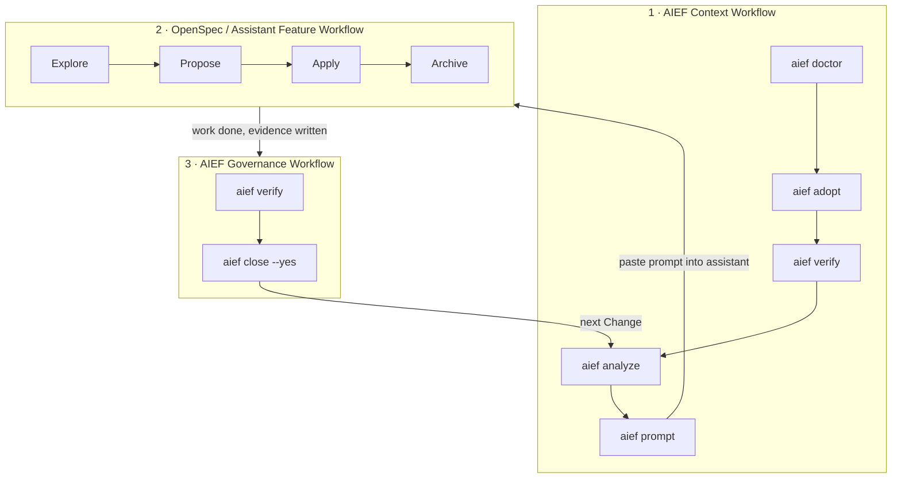

# The AIEF Workflow

> Canonical description of how AIEF, OpenSpec, SpecBoot-style skills and AI assistants work together. Other documents summarize this one.

AIEF is an **AI Engineering Workflow Engine**. It does not replace OpenSpec, SpecBoot or your AI assistant — it coordinates the process, preserves context and guides the user.

The full workflow has **three levels**:



## Level 1 — AIEF Context Workflow

```text
doctor -> adopt -> verify -> analyze -> prompt
```

AIEF prepares the project and the context:

- detect the stack (with verifiable reasons),
- adopt an existing project without touching application code (`aief adopt`, or `aief init` without arguments — same guarantees, same logic),
- create the AIEF structure and editable project standards (`knowledge/standards/`),
- seed the Analysis Change with detected signals, Skills, standards and inferred risks,
- generate prompts that carry AGENTS.md, the assistant file, the profile, the standards and the recommended Skills.

**This level never implements functional code.**

### The adoption Change

After `adopt` + `analyze` you will normally have two Changes: `0001-adopt-aief` (evidence auto-generated) and `0002-analyze-current-architecture`. This is correct and requires no special handling:

- You do **not** need to close the adoption Change first.
- The latest open Change is automatically the active one, so `prompt` and `close` target the Analysis Change.
- Close the adoption Change whenever its remaining human tasks are done (adapt the standards, run verify): `aief close --yes --change adopt-aief` — before or after the Analysis, the order does not affect AIEF.

## Level 2 — OpenSpec / Assistant Feature Workflow

The development cycle itself runs in your AI assistant, optionally powered by OpenSpec.

The **verified official OpenSpec workflow** (Fission-AI/OpenSpec, documentation reviewed 2026-07-03) is:

```text
Explore -> Propose -> Apply -> Archive
```

driven by assistant slash commands (e.g. `/opsx:propose`). OpenSpec profiles and assistants may expose additional commands (e.g. `/opsx:verify`, `/opsx:new`), and teams often extend the cycle with **SpecBoot-style skills** such as *enrich-us* (refining user stories) or *adversarial review* (systematic critique). Those extensions are useful examples — **they are not part of the validated official OpenSpec workflow** and AIEF does not depend on them.

Responsibilities at this level: turn ideas into proposals, organize specs/tasks when OpenSpec exists, assist implementation, review changes, archive within OpenSpec, prepare commits when the team decides so.

**AIEF does not implement or duplicate any of this.** OpenSpec is optional: when it is not installed, AIEF's local Change skeleton (`aief propose` / `aief new-change`) is the **normal path, not a degradation** — see [with / without OpenSpec](#with-openspec--without-openspec).

## Level 3 — AIEF Governance Workflow

```text
verify -> close
```

After the work, AIEF validates consistency and closes the cycle:

- `aief verify` — structure, Change files, evidence completeness, calm reporting for work in progress,
- `aief close` — readiness report (files, unchecked tasks, placeholder evidence); `aief close --yes` marks the Change **Closed** inside its own `change.md`, the only source of truth.

AIEF does not create commits and does not publish PRs — humans (or their tooling) do.

## Responsibilities

| Actor | Responsibility | Never does |
|---|---|---|
| **AIEF** | Workflow orchestration: context, standards, Skills, prompts, evidence, governance | Generate specs, implement code, commit, archive in OpenSpec |
| **OpenSpec** *(optional)* | Proposal → Spec → Tasks engine (Explore → Propose → Apply → Archive) | Project adoption, evidence, Change governance |
| **SpecBoot** *(inspiration only)* | Conceptual source for standards, instruction hierarchy and skills | Nothing at runtime — AIEF copies no SpecBoot files and has no dependency on it |
| **AI assistants** | Analysis, implementation, review, documentation | Approve scope or releases (humans decide) |
| **Skills** | Specialized knowledge injected into prompts as context | Execute anything — they are knowledge, not commands |

## `aief close` vs OpenSpec `/archive`

They sound similar but operate at different levels:

| | `aief close --yes` | OpenSpec `/archive` |
|---|---|---|
| Level | 3 — AIEF Governance | 2 — Feature Workflow |
| Acts on | The AIEF Change (`changes/<id>/change.md`) | The OpenSpec change (`openspec/changes/<name>/`) |
| Checks first | Files present, tasks checked, evidence completed | OpenSpec's own workflow state |
| Writes | A dated `## Status / Closed` section in change.md | Moves the change into OpenSpec's archive |
| Replaces the other? | **No** | **No** |

If you use both tools, archive in OpenSpec **and** close in AIEF — each governs its own artifact.

## With OpenSpec / without OpenSpec

**Without OpenSpec (default, fully supported):**

```text
aief new-change <name>      # or: aief propose "<idea>"  (announces the local path)
edit change.md / spec.md    # you and your assistant define the work
aief prompt claude
aief verify && aief close --yes
```

**With OpenSpec:**

```text
aief adopt / analyze / prompt        # AIEF provides context (level 1)
/opsx:propose ... /opsx:apply ...    # assistant drives OpenSpec (level 2)
/opsx:archive                        # close the OpenSpec change
aief verify && aief close --yes      # AIEF governance (level 3)
```

`aief propose` checks the OpenSpec contract at runtime and always announces what it does; falling back to the local skeleton is expected behavior (see [adapters/openspec/](../adapters/openspec/README.md)).

## What AIEF does not do

- It does not generate proposals, specs or tasks content — OpenSpec and/or the assistant do.
- It does not implement, review or document application code — assistants and humans do.
- It does not execute Skills — they are contextual knowledge in prompts.
- It does not create commits, publish PRs or archive OpenSpec changes.
- It does not keep hidden state — `change.md` is the only source of truth (no `active-change.json`).
- It does not replace AGENTS.md, OpenSpec, SpecBoot or your AI assistant.
- It does not claim validation against an installed OpenSpec release until one is actually exercised.

## The Change lifecycle (all levels together)

```text
Idea
  -> aief new-change / analyze            (level 1: context)
  -> aief prompt -> assistant works       (level 2: feature, with or without OpenSpec)
  -> evidence.md completed                (level 2 output)
  -> aief verify -> aief close --yes      (level 3: governance)
  -> next Change
```

Every meaningful unit of work is a Change; every Change ends with evidence; every closed Change carries its status in its own files.
