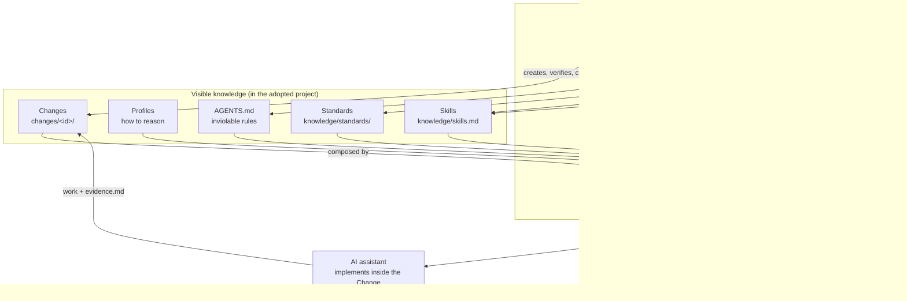
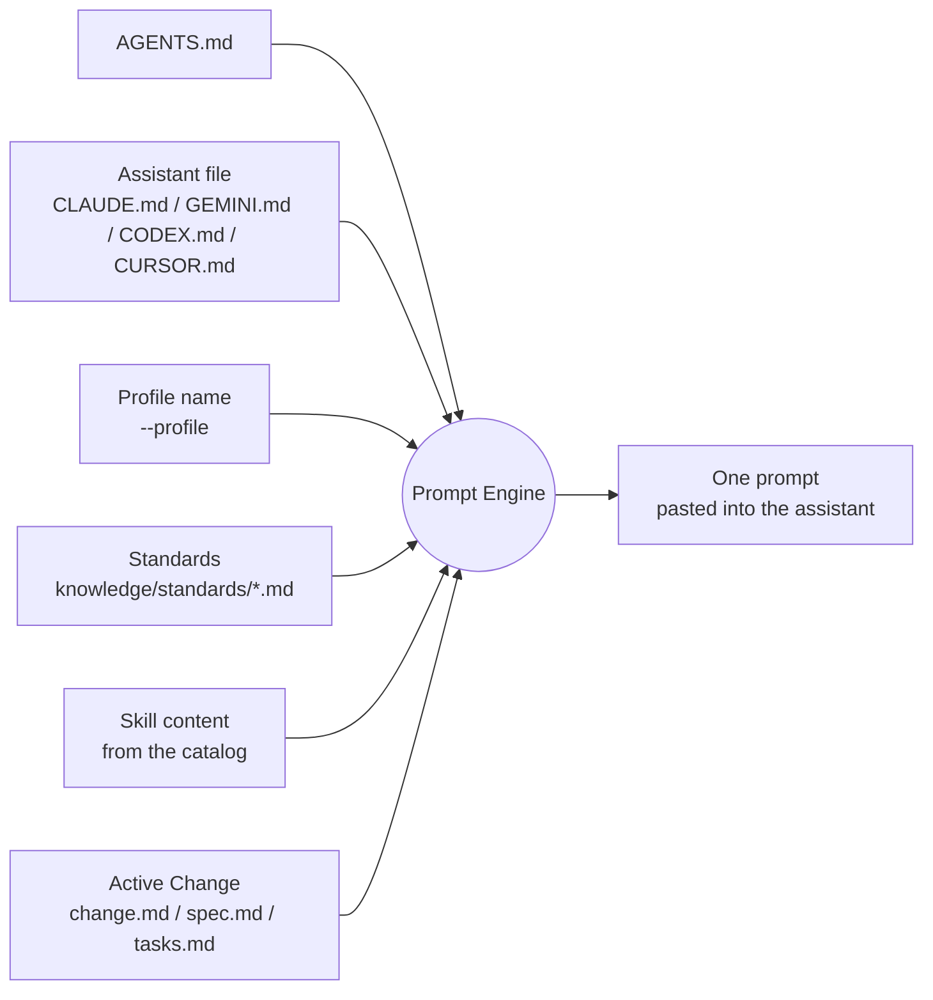

# AIEF Architecture

> Canonical description of the implemented architecture. The conceptual v1 specs under [specs/](../specs/) are historical reference; this document describes what exists today. Decisions behind this architecture: [knowledge/decisions.md](../knowledge/decisions.md).

## Conceptual model

AIEF is a **workflow engine**: a dependency-free CLI that operates on visible files. There is no daemon, no database, no hidden state — the repository *is* the runtime state.

Two engines and one composition rule:

- The **Workflow Engine** owns the Change lifecycle (create → work → verify → close) and project adoption.
- The **Prompt Engine** is the *only* place where the knowledge dimensions are composed into a prompt ([ADR-012](../knowledge/decisions.md)) — sources never compose each other.
- The **Detection Engine** is data-driven: detectors, recommendations and Skill content are catalog entries ([ADR-007](../knowledge/decisions.md)); the engine knows nothing about specific technologies.

## Workflow Engine

Implemented in [cli/src/cli.js](../cli/src/cli.js) as three levels ([canonical workflow](Workflow.md), [ADR-011](../knowledge/decisions.md)):

| Level | Commands | Owns |
|---|---|---|
| 1 · Context | `doctor`, `init`, `adopt`, `analyze`, `new-change`, `propose`, `prompt`, `status` | Preparing project + context |
| 2 · Feature | *(none — assistant + optionally OpenSpec)* | The engineering work itself |
| 3 · Governance | `verify`, `close` | Structure checks and Change closure |

Key mechanics:

- **A Change is the unit of work**: `changes/<id>-<slug>/` with `change.md`, `spec.md`, `tasks.md`, `evidence.md`. IDs are sequential; `adopt` always takes the next free ID.
- **The active Change is derived**, never stored: the latest Change whose `change.md` has no `## Status / Closed` section, overridable with `--change` ([ADR-009](../knowledge/decisions.md)).
- **Adoption is safe by contract**: `init`/`adopt` never modify application code, never overwrite existing files, and are idempotent ([ADR-005](../knowledge/decisions.md)). These guarantees are covered by the test suite.
- **Every command is guided**: purpose, reads, writes, example and next step via `aief help <command>` ([ADR-006](../knowledge/decisions.md)).

## Prompt Engine and Context Composition

`aief prompt [assistant] [--profile X] [--change id]` composes one ready-to-paste prompt from the four knowledge dimensions plus the active Change. Composition is the renderer's job — no source file references another ([ADR-012](../knowledge/decisions.md)).

The composed prompt also carries lifecycle guardrails learned from real validations: re-run safety (existing real evidence must be amended, not overwritten), where results belong (project evidence vs tooling feedback), and Analysis-specific constraints (no source-code modification).

Assistant selection is explicit and fails loudly: unknown assistant names produce guidance, never a silent fallback.

## The knowledge dimensions

Each layer answers one orthogonal question ([ADR-012](../knowledge/decisions.md)); none may absorb another.

### AGENTS.md — *What rules must never be violated?*

The constitution binding every assistant in every Change ([ADR-004](../knowledge/decisions.md)). Created by `init`/`adopt` if missing; assistant files extend it and must not contradict it. It holds inviolable rules only — it must never become a knowledge base.

### Profiles — *How should I reason?*

Selected explicitly by the human per Change (`--profile architect|developer|...`), never detected from the project. **Implementation status (honest):** today the profile is injected as a named role ("Act as the architect profile"); the structured operational model (goal, thinkingStyle, priorities, expectedOutputs, avoid) is accepted architecture ([ADR-012](../knowledge/decisions.md)) whose implementation Change has not started yet.

### Standards — *How should this project be built?*

Editable project property under `knowledge/standards/` ([ADR-010](../knowledge/decisions.md)). `adopt` creates starters (base, documentation, testing, security — plus frontend/backend when signals fire) from [cli/templates/standards/](../cli/templates/standards/), marked with `(adapt)` lines for the team to make their own. Never overwritten on re-adoption.

### Skills — *What should I know?*

Specialized technology/domain knowledge, recommended when detection signals fire. Three distinct concepts live in [cli/src/skills-catalog.json](../cli/src/skills-catalog.json) ([ADR-007](../knowledge/decisions.md), [ADR-010](../knowledge/decisions.md)):

1. **Detectors** — fire on project signals (strong = dependencies/files; weak = documented keywords, word-boundary matched).
2. **Recommendations** — map detectors to Skills, always with a stated reason.
3. **Skill content** — operational knowledge (promptContext, commonRisks, standardsToRead, evidenceExpectations) injected into prompts *as context*. Skills are never executed.

`adopt` renders the recommendations into `knowledge/skills.md` so the project owns a readable view.

## Evidence

`evidence.md` is the Change's proof: what changed, how it was verified, what remains, what was learned. The system treats it as load-bearing:

- `adopt` generates its own adoption evidence (never placeholder).
- `prompt` guards existing real evidence against blind overwrites.
- `verify` reports placeholder evidence calmly for open Changes and warns for closed ones.
- `close` refuses to close a Change whose evidence is incomplete.

Evidence is also how AIEF itself evolves: product improvements must trace to validated adoption findings ([ADR-008](../knowledge/decisions.md)).

## Verify

`aief verify` (level 3, read-only) checks: required files (`README.md`, `AGENTS.md`, `changes/`), each Change's four files present and non-empty, and evidence completeness — then prints PASS/FAIL with the next recommended step. It is the pre-close and pre-commit gate.

## Close

`aief close` runs readiness checks (files present, tasks checked, evidence completed) and reports. Only `close --yes`, with all checks passing, writes the single thing the governance level ever writes: a dated `## Status / Closed` section inside the Change's own `change.md`. Closing a Change automatically promotes the next open one to active. `aief close` is not OpenSpec `/archive` — each governs its own artifact ([ADR-011](../knowledge/decisions.md), [comparison](Workflow.md#aief-close-vs-openspec-archive)).

## Bootstrap and distribution

AIEF ships as a root npm package exposing the `aief` binary from [cli/bin/aief.js](../cli/bin/aief.js) (`npm install && npm link` from the repo root; no dependencies; Node >= 18). `aief doctor` verifies the environment in levels (required / recommended / optional) and `aief init` initializes projects — details in [bootstrap.md](bootstrap.md).

## What is deliberately absent

- No hidden `.aief/` directory, state files or databases ([ADR-009](../knowledge/decisions.md); reaffirmed in Changes 0017 and 0025).
- No spec generation ([ADR-001](../knowledge/decisions.md), [ADR-002](../knowledge/decisions.md)).
- No vendored SpecBoot files ([ADR-003](../knowledge/decisions.md)).
- No assistant-specific logic in the engine — assistant differences end at the instruction-file name.
- No technology knowledge in engine code — it lives in the catalog ([ADR-007](../knowledge/decisions.md)).
