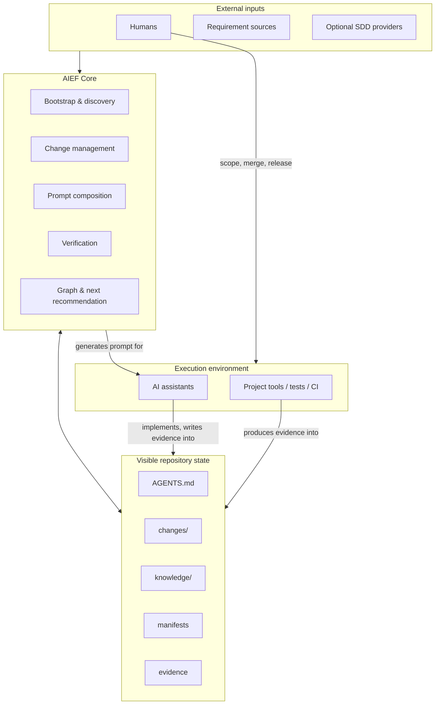
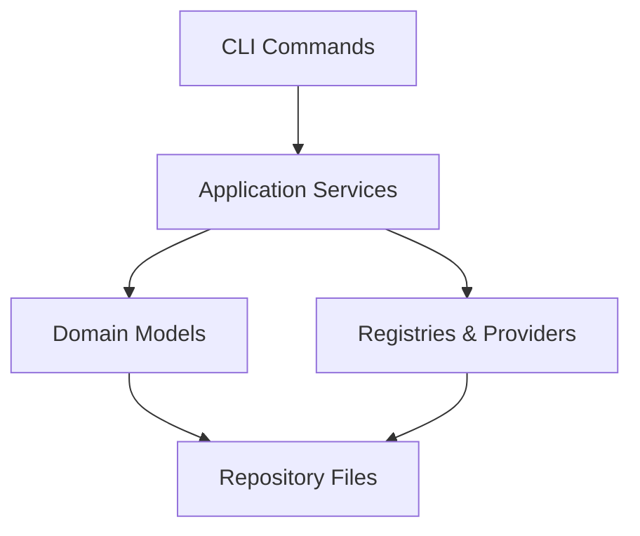
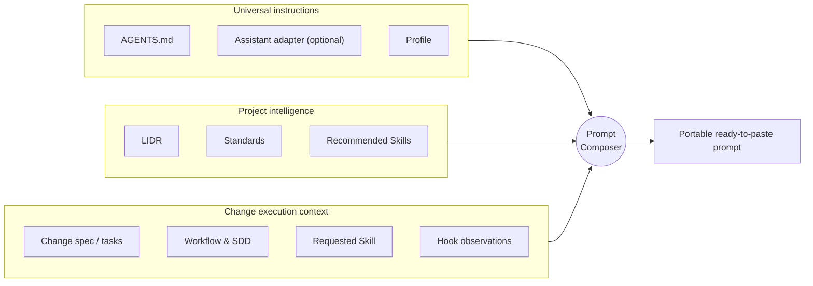
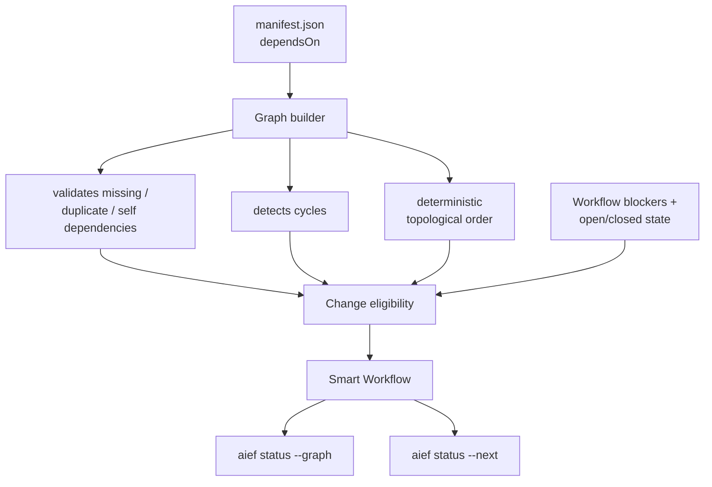

# Architecture

The implemented architecture, as it exists today. There is no daemon, no database, no hidden
state — the repository *is* the runtime state, and the CLI is a stateless function of the files on
disk each time it runs.

## Architectural principles

- **The repository is the source of truth.** No `.aief/` directory, no session state, no cache. A
  command re-derives everything it needs from files on disk every time it runs.
- **AIEF composes and verifies; it never implements.** No engine code writes application code,
  runs a test, or calls the network on your behalf.
- **Every capability beyond the classic path is opt-in**, declared per Change in `manifest.json`,
  and additive — a Change or project that doesn't opt in behaves exactly as if the capability
  didn't exist.
- **Recommendation, never execution.** Anything that looks like automation (`status --next`,
  Loop's "retry", a Hook's observation) prints a suggestion or a fact; nothing in the engine
  re-invokes a command, an assistant, or itself.
- **One implementation per concept.** A domain model owns a shape, a service owns the one
  orchestration of it, a registry maps an id to an implementation — never duplicated per caller.

## System context

Four zones, and one rule connecting them: AIEF reads and writes only the *visible* repository
state in the fourth zone — it never reaches into the execution environment directly.


```mermaid
flowchart TD
    subgraph EXT["External inputs"]
        H["Humans"]
        RS["Requirement sources"]
        SDD["Optional SDD providers"]
    end

    subgraph CORE["AIEF Core"]
        BS["Bootstrap & discovery"]
        CM["Change management"]
        PC["Prompt composition"]
        VF["Verification"]
        GR["Graph & next recommendation"]
    end

    subgraph EXEC["Execution environment"]
        AI["AI assistants"]
        TOOLS["Project tools / tests / CI"]
    end

    subgraph REPO["Visible repository state"]
        AG["AGENTS.md"]
        CH["changes/"]
        KN["knowledge/"]
        MF["manifests"]
        EV["evidence"]
    end

    EXT --> CORE
    CORE <--> REPO
    CORE -->|generates prompt for| AI
    AI -->|implements, writes evidence into| REPO
    TOOLS -->|produces evidence into| REPO
    H -->|scope, merge, release| EXEC
```

AIEF reads and writes the files in **Visible repository state** — it never executes an assistant,
a test runner, or CI itself. `aief prompt` produces text a human pastes into an assistant; the
assistant, running independently in the **Execution environment**, modifies the project and writes
`evidence.md`. Test runners and CI produce evidence the same way, outside AIEF's control. Humans
retain scope, merge, and release authority throughout — AIEF never commits, opens a PR, or
approves anything.

## Core runtime architecture

Every subsystem follows the same four-layer split, top to bottom:


```mermaid
flowchart TD
    CLI["CLI Commands"]
    APP["Application Services"]
    DOM["Domain Models"]
    REG["Registries & Providers"]
    FS["Repository Files"]

    CLI --> APP --> DOM
    APP --> REG
    DOM --> FS
    REG --> FS
```

- **CLI Commands** — `doctor`, `bootstrap`, `prompt`, `verify`, `status`, `close`, and a handful of
  others. Each parses arguments, resolves the target Change, and renders output; none contains
  business logic of its own.
- **Application Services** — Workflow, Prompt, Verification, Harness/Loop, Graph/Next. Each is the
  single place a cross-cutting concern is orchestrated; a command never re-implements what a
  service already does.
- **Domain Models** — Change, Manifest, Requirement, Skill, Hook, Graph. Pure shape and validation,
  no I/O beyond parsing a string it's handed.
- **Registries / Providers** — Workflows, Skills, Hooks, Verification rules, SDD providers,
  Requirement providers. Static, statically-imported maps from id to implementation — adding one
  means adding a file and a registry entry, never touching a caller.
- **Repository** — Change files, knowledge, config, evidence. The actual state; every layer above
  is a stateless function over it.

| Layer | Responsibility | Where |
|---|---|---|
| CLI Commands | Argument parsing, Change resolution, output rendering | `cli/bin/aief.js`, `cli/src/cli.js` |
| Application Services | Workflow, Prompt, Verification, Harness/Loop, Graph/Next orchestration | `cli/src/*-service.js` |
| Domain Models | Change, Manifest, Requirement, Skill, Hook, Graph shapes | `cli/src/change.js`, `change-manifest.js`, `sdd-model.js`, `skill.js`, `hook.js`, `change-graph.js` |
| Registries / Providers | Static id-to-implementation maps | `cli/src/workflows/`, `sdd-providers/`, `skills/`, `hooks/`, `verification-rules/`, `requirement-providers/` |
| Repository | The actual state read/written every run | `changes/`, `knowledge/`, `manifest.json`, `evidence.md` |

## Change lifecycle data model

A Change is a directory (`changes/<id>-<slug>/`) of plain files: `change.md`, `spec.md`,
`tasks.md`, `evidence.md`, and an optional `manifest.json`. `change.js` derives everything about a
Change — open/closed, type, evidence placeholder-or-not, open task count — by reading those files
directly, never from a separate index. `change-loader.js` layers the optional manifest on top: when
present and valid, it is authoritative for the fields it declares (never merged with `change.md`'s
own prose); when absent, invalid, or silent on a field, nothing changes from the classic behavior.
An invalid manifest is a distinct, visible state (`aief status` reports it explicitly) — never
silently treated as "no manifest."

A Change that declares a `track` in its manifest gets a small Workflow Engine state machine layered
on top, read-only from the outside: `workflow-definition.js` loads one of three static JSON stage
graphs (`lite`/`standard`/`governed`), `gate-evaluator.js` evaluates each stage's declared gates
against the Change's own facts, and `transition-engine.js` resolves the current stage and legal
next transition. `workflow-service.js` is the single place `status`/`prompt`/`verify` all call for
"what stage is this Change in" — there is exactly one implementation, not one per command.

## Prompt composition

`aief prompt` is the only place context is composed into one prompt — no source file references
another. Three groups feed the composer; a group that doesn't apply stays silent rather than
producing an empty section.


```mermaid
flowchart LR
    subgraph U["Universal instructions"]
        AG["AGENTS.md"]
        AF["Assistant adapter (optional)"]
        PRO["Profile"]
    end
    subgraph PI["Project intelligence"]
        LIDR["LIDR"]
        STD["Standards"]
        SKL["Recommended Skills"]
    end
    subgraph CE["Change execution context"]
        CHG["Change spec / tasks"]
        WF["Workflow & SDD"]
        RSK["Requested Skill"]
        HK["Hook observations"]
    end

    U --> P((Prompt<br/>Composer))
    PI --> P
    CE --> P
    P --> OUT["Portable ready-to-paste prompt"]
```

`AGENTS.md` is always the base contract — every generated prompt opens with "Use AGENTS.md." first,
regardless of assistant. An assistant adapter (`CLAUDE.md`, `GEMINI.md`, ...) only ever adapts
tone and phrasing, never contradicts it, and is entirely optional: a project with none still gets a
complete prompt. Every other block is additive; a Change with no `track`, no Skill request, and no
Harness configuration produces output identical to a project that never adopted those features.
AIEF generates this prompt as text — it never calls an assistant's API or invokes it directly.

## Verification and evidence

`aief verify` always runs **Structural Verification** first, unconditionally: are the Change's
required files present, is the manifest (if any) consistent, is evidence more than a placeholder,
how many tasks remain open.

`aief verify --change <id> --requirements` additionally runs **Requirement Verification**:
`verification-rule.js` defines the rule contract and a six-type evidence vocabulary, of which only
`artifact_state` (an SDD provider's own normalized state) and `file_assertion` (a path-contained
filesystem check) are supported today. `verification-service.js` resolves applicable rules per
requirement and aggregates verdicts into one five-state result
(`ERROR > INVALID > FAIL > INCOMPLETE > PASS`, fixed precedence — never a boolean reduction).
Results are deterministic and evidence-grounded — never AI-judged, never a live test execution.

Both layers are informational inputs to a human decision; neither ever changes `aief close`'s own
readiness check.

## Graph Engineering and Smart Workflow

A Change's `manifest.json` may declare `dependsOn`, naming other Changes it depends on. The Graph
is derived fresh from disk on every command — nothing is persisted beyond `manifest.json` itself.


```mermaid
flowchart TD
    MF["manifest.json<br/>dependsOn"] --> GB["Graph builder"]
    GB --> V1["validates missing /<br/>duplicate / self dependencies"]
    GB --> V2["detects cycles"]
    GB --> V3["deterministic<br/>topological order"]
    V1 --> ELIG["Change eligibility"]
    V2 --> ELIG
    V3 --> ELIG
    WB["Workflow blockers +<br/>open/closed state"] --> ELIG
    ELIG --> SW["Smart Workflow"]
    SW --> CMD1["aief status --graph"]
    SW --> CMD2["aief status --next"]
```

The Graph is **read-only**: `change-graph.js` exports one pure function, `buildGraph(nodes)`, with
no filesystem access of its own — `cli.js` gathers real Changes and hands them in. It never writes
a Change, never mutates `manifest.json`, and is rebuilt from scratch every invocation, so it can
never drift from what's actually on disk.

`status --next` **recommends only** — it never executes, re-prompts, or advances anything. A
Change is eligible when it is open, has a valid manifest, every dependency exists and is closed,
it isn't part of a cycle, and it has no unsatisfied Workflow gate blocker; the lowest Change id
wins ties. With zero declared `dependsOn` edges anywhere in a project, every open Change is
independent and immediately eligible — **only an explicit `dependsOn` entry creates an edge; the
Graph never infers one.**

Example:

```json
{ "id": "0002-add-payments", "dependsOn": ["0001-user-model"] }
```

Change `0002` is not eligible until Change `0001` is closed — `aief status --graph` shows the edge
and the topological order; `aief status --next` explains the block by name.

This project's own `changes/` directory currently has **zero** `dependsOn` edges — every Change to
date has been independent. The Graph and Smart Workflow are new, general-purpose capabilities
available to any project; they were not exercised as dependency-linked work by this repository's
own historical Changes.

## Extension model

Every registry is a plain, statically-imported object — there is no plugin loader. Adding a Skill,
Hook, Verification Rule, SDD provider, or Requirement provider means adding one file and one
registry entry, never touching a caller.

- **Skills** (`skill.js`, `skills/index.js`, `skill-service.js`) — a closed capability vocabulary
  and a seven-status result contract; `writeFiles`, `executeCommands`, and `network` cannot be
  declared `true` by any Skill this release, so a Skill attempting to register with one fails
  registration outright.
- **Hooks** (`hook.js`, `hooks/index.js`, `hook-service.js`) — the same descriptor discipline, fired
  on a closed two-event catalog (`prompt.prepared`, `verify.completed`); a Hook has no path back
  into the exit code or file state at all — purely observational by construction.
- **Harness** (`harness-service.js`) is the opt-in configuration/logging layer over Hooks: it
  reads a Change's `manifest.json` `harness` field, resolves it against the real Hook Registry, and
  filters/formats results after evaluation — it never changes which Hooks are evaluated.
- **Loop** (`loop-service.js`) is a small pure module over `aief verify --change`'s own already-
  computed errors: it tracks attempt count and reports `passed`/`retry_available`/`exhausted`.
  "Retry" is a reported outcome, never an action Loop performs.
- **SDD Provider** (`sdd-model.js`, `sdd-providers/`, `sdd-provider-resolver.js`) — a
  provider-neutral `Requirement`/`Task`/`Readiness` shape; no command reads an OpenSpec or local
  artifact file directly, every read goes through the resolved provider.

## Deliberate boundaries

- No hidden `.aief/` directory, state file, or database.
- No spec generation inside AIEF's own core — OpenSpec or a human owns that.
- No vendored SpecBoot files — inspiration only, never copied.
- No assistant-specific logic in the engine — differences end at the instruction-file name.
- No technology-specific knowledge in engine code — it lives in the Skill Catalog (`detect.js`,
  `skills-catalog.json`).
- No plugin loader — every registry is static, reviewed, and statically imported.
- No blocking authority for Harness, Hooks, Loop, or Graph — all four are non-blocking by
  construction, not merely by convention.
- No automatic execution anywhere — `status --next` recommends, Loop reports "retry available,"
  a Hook observes; nothing in the engine re-invokes a command, an assistant, or itself.

## Implementation map

| Concept | Files |
|---|---|
| CLI dispatch | `cli/bin/aief.js`, `cli/src/cli.js` |
| Change model | `change.js`, `change-loader.js`, `change-manifest.js` |
| Workflow Engine | `workflow-definition.js`, `workflow-service.js`, `gate-evaluator.js`, `transition-engine.js`, `cli/src/workflows/*.json` |
| SDD Provider | `sdd-model.js`, `sdd-provider-resolver.js`, `sdd-providers/local.js`, `sdd-providers/openspec.js` |
| Skills Runtime | `skill.js`, `skills/index.js`, `skill-service.js`, `skill-context.js` |
| Hooks Runtime & Harness | `hook.js`, `hooks/index.js`, `hook-service.js`, `hook-context.js`, `harness-service.js` |
| Loop | `loop-service.js` |
| Graph & Smart Workflow | `change-graph.js`, `next-change-service.js` |
| Verification Engine | `verification-rule.js`, `verification-rules/index.js`, `verification-service.js`, `verification-context.js`, `verification-evidence.js`, `change-verifier.js` |
| Prompt composition | `aief prompt` in `cli.js` |
| Detection / Skill Catalog | `detect.js`, `skills-catalog.json` |
| Bootstrap & distribution | `cli/bin/aief.js`, `cli/templates/` |
