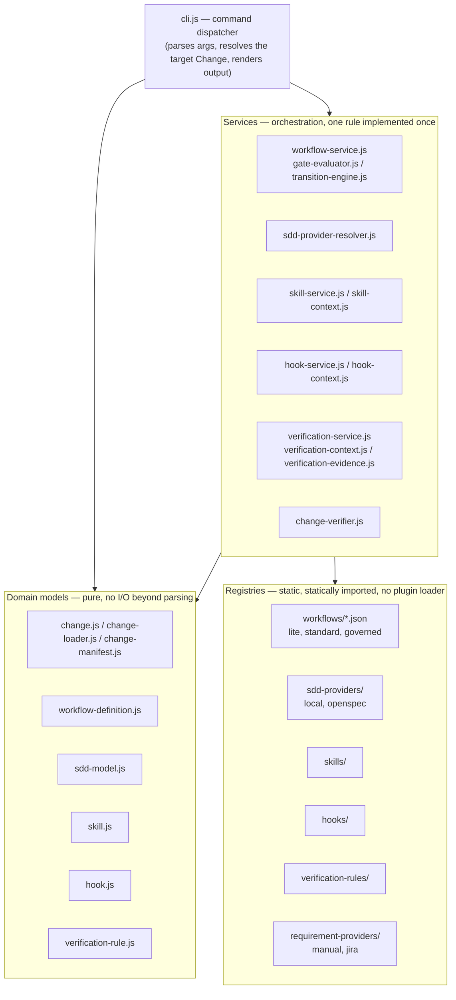
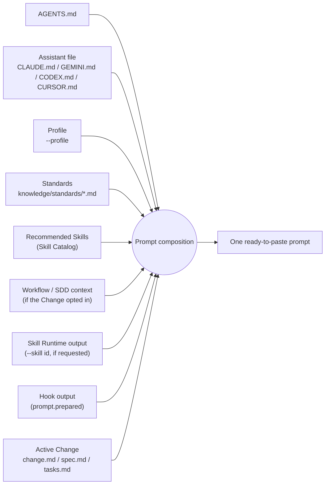

# Architecture

The implemented architecture, as it exists today. There is no daemon, no database, no hidden
state — the repository *is* the runtime state, and the CLI is a stateless function of the files on
disk each time it runs.

## Layers

```mermaid
flowchart TD
    CLI["cli.js — command dispatcher\n(parses args, resolves the target Change, renders output)"]
    subgraph Domain["Domain models — pure, no I/O beyond parsing"]
        CH[change.js / change-loader.js / change-manifest.js]
        WD[workflow-definition.js]
        SD[sdd-model.js]
        SK[skill.js]
        HK[hook.js]
        VR[verification-rule.js]
    end
    subgraph Services["Services — orchestration, one rule implemented once"]
        WS[workflow-service.js\ngate-evaluator.js / transition-engine.js]
        SDR[sdd-provider-resolver.js]
        SKS[skill-service.js / skill-context.js]
        HKS[hook-service.js / hook-context.js]
        VS[verification-service.js\nverification-context.js / verification-evidence.js]
        CVS[change-verifier.js]
    end
    subgraph Registries["Registries — static, statically imported, no plugin loader"]
        WF[workflows/*.json\nlite, standard, governed]
        SDP[sdd-providers/\nlocal, openspec]
        SKR[skills/]
        HKR[hooks/]
        VRR[verification-rules/]
        RP[requirement-providers/\nmanual, jira]
    end
    CLI --> Domain
    CLI --> Services
    Services --> Domain
    Services --> Registries
```

Every subsystem follows the same three-layer split: a **domain model** owns the shape and pure
validation of a concept (never touches the filesystem beyond parsing a string it's handed); a
**service** orchestrates domain models against real Change directories; a **registry** is a plain,
statically-imported object mapping an id to an implementation — adding a new Skill, Hook,
Verification Rule, SDD provider, or Requirement provider means adding one file and one registry
entry, never touching a caller.

## The Change model

A Change is a directory (`changes/<id>-<slug>/`) of plain files. `change.js` derives everything
about it from those files — closed/open, type (general/analysis/enrichment), evidence
placeholder-or-not, open task count — by reading `change.md`/`evidence.md`/`tasks.md` directly,
never from a separate index. `change-loader.js` adds the optional `manifest.json` on top: when
present and valid, it is authoritative for the fields it declares (never merged with `change.md`'s
own prose); when absent, invalid, or silent on a field, nothing changes from the classic behavior.
An invalid manifest is a distinct, visible state (`aief status` reports it explicitly) — never
silently treated as "no manifest."

## Workflow Engine

`workflow-definition.js` loads one of three static JSON files (`cli/src/workflows/{lite,standard,
governed}.json`) — each a `{ stages, transitions }` graph with optional `gateIds` per stage.
`gate-evaluator.js` evaluates each declared gate against the Change's own facts (never against
network or command output); `transition-engine.js` resolves the current stage and the legal next
transition from those results. `workflow-service.js` is the single place that composes
load → evaluate → resolve into the `nextAction()`/`explain()` calls every CLI command
(`status`, `prompt`, `verify`) shares — there is exactly one implementation of "what stage is this
Change in," not one per command.

## SDD Provider

`sdd-model.js` defines the provider-neutral `Requirement`/`Task`/`Readiness` shapes. Two providers
implement them (`sdd-providers/local.js`, `sdd-providers/openspec.js`); `sdd-provider-resolver.js`
picks one from `manifest.json`'s `sdd.provider` field and hands back a resolved provider bound to
the Change. No command reads an OpenSpec or local artifact file directly — every read goes through
the provider's own `resolveChange()`/`validate()` methods, so the file layout a provider reads is
that provider's private concern.

## Skills Runtime

`skill.js` defines the descriptor shape (id, version, `capabilities`, `appliesTo()`, optional
`buildInstructions()`), a closed capability vocabulary, and the seven-status result vocabulary.
`skills/index.js` is the static registry; `skill-service.js` resolves an id, builds a
`skill-context.js` (the Change + project facts a Skill is allowed to see), and calls the Skill,
translating any thrown error into a reportable `failed` status rather than crashing the CLI.
Three capabilities (`writeFiles`, `executeCommands`, `network`) cannot be declared `true` by any
Skill this release — a Skill attempting to register with one of them fails registration outright,
so the restriction cannot be bypassed by an unreviewed edit.

## Hooks Runtime and Harness

`hook.js` defines a closed, two-event catalog (`prompt.prepared`, `verify.completed`) and the same
descriptor/capability discipline as Skills. `hooks/index.js` is the static registry;
`hook-service.js` evaluates every registered Hook against a built `hook-context.js` for the fired
event, unconditionally, exactly as before Change 0056. A Hook's declared capabilities can never
include `writeFiles`/`executeCommands`/`network` either, and — unlike a Skill — a Hook has no path
back into the exit code or file state at all: it is purely observational by construction, not
merely by convention. None of `hook.js`/`hooks/index.js`/`hook-service.js`/`hook-context.js` was
modified by Change 0056/ADR-026.

**Harness** (Change 0056, ADR-026) is the layer above that: `harness-service.js` reads a Change's
optional `manifest.json` `harness` field (structurally validated in `change-manifest.js`, mirroring
the `sdd` field's own precedent) and resolves it against the real Hook Registry —
`resolveHarnessConfig()` for configuration, `partitionOutcome()` to split an already-computed
`evaluateEvent()` result into active vs. Change-disabled Hooks (a post-evaluation filter — nothing
about which Hooks get evaluated changes), and `formatHookResultsBlock()`/`formatHookLogSection()`
for presentation (`aief prompt`'s Hook section, and `<changeDir>/hooks.md` when a Change opts into
`harness.log`). `aief doctor --verbose` and `aief status --change <id>` are the two read surfaces;
neither can enable a Hook capability the registry itself doesn't already declare.

## Verification Engine

`verification-rule.js` defines the Verification Rule contract (scope, capabilities, `appliesTo()`,
`evaluate()`) and a six-type Evidence vocabulary, of which only `artifact_state` (an SDD provider's
own normalized state) and `file_assertion` (a path-contained filesystem check) are supported this
release. `verification-rules/index.js` is the static registry (`requirement-has-traceability`,
`evidence-reference-integrity` today); `verification-service.js` resolves applicable rules per
requirement and aggregates per-rule verdicts into one five-state result
(`ERROR > INVALID > FAIL > INCOMPLETE > PASS`, fixed precedence — never a boolean reduction).
`change-verifier.js` (Structural Verification) is untouched by any of this: the two layers compose
in `cli.js`, they do not call into each other.

## Prompt composition

`aief prompt` is the only place the knowledge dimensions are composed into one prompt — no source
file references another:

```mermaid
flowchart LR
    AG[AGENTS.md] --> P
    AF["Assistant file\nCLAUDE.md / GEMINI.md / CODEX.md / CURSOR.md"] --> P
    PRO["Profile\n--profile"] --> P
    STD["Standards\nknowledge/standards/*.md"] --> P
    SKL["Recommended Skills\n(Skill Catalog)"] --> P
    WFB["Workflow / SDD context\n(if the Change opted in)"] --> P
    SKR["Skill Runtime output\n(--skill id, if requested)"] --> P
    HKB["Hook output\n(prompt.prepared)"] --> P
    CHG["Active Change\nchange.md / spec.md / tasks.md"] --> P
    P((Prompt composition)) --> OUT[One ready-to-paste prompt]
```

Each block is additive and independently silent when it doesn't apply — a Change with no `track`
produces byte-identical output to before any Core 3.0 subsystem existed. Assistant selection is
explicit and fails loudly on an unknown name; there is no per-assistant branch anywhere else in the
engine.

## Detection

`detect.js` plus `skills-catalog.json` drive `doctor`/`adopt`/`analyze`'s project detection: strong
signals (dependencies, files) and weak signals (documented keywords, word-boundary matched) map to
recommended Skills, always with a stated reason. This is the **Skill Catalog** — static,
unexecuted, contextual recommendation data — distinct from the Skills Runtime above, which is a
registered, invocable contract. No engine code branches on a specific technology; adding one means
editing the catalog.

## Bootstrap and distribution

AIEF ships as a root npm package exposing the `aief` binary from `cli/bin/aief.js`. No runtime
dependencies. `aief doctor` checks the environment in three levels (required / recommended /
optional); `aief bootstrap` creates only visible structure, never application code, and is
idempotent. See [Getting Started](getting-started.md).

## What is deliberately absent

- No hidden `.aief/` directory, state files, or database.
- No spec generation inside AIEF's own core — OpenSpec or a human owns that.
- No vendored SpecBoot files.
- No assistant-specific logic — differences end at the instruction-file name.
- No technology-specific knowledge in engine code — it lives in the Skill Catalog.
- No plugin loader for Skills/Hooks/Verification Rules/SDD providers — every registry is a static,
  reviewed, statically-imported object.
