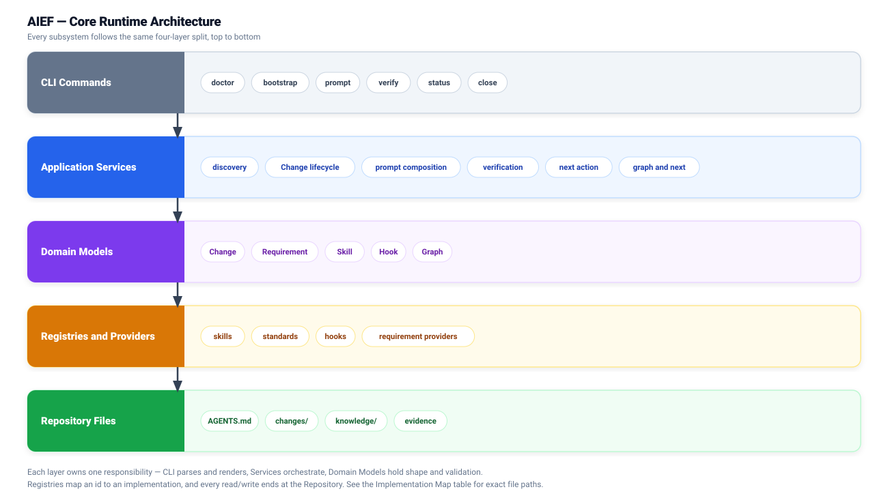
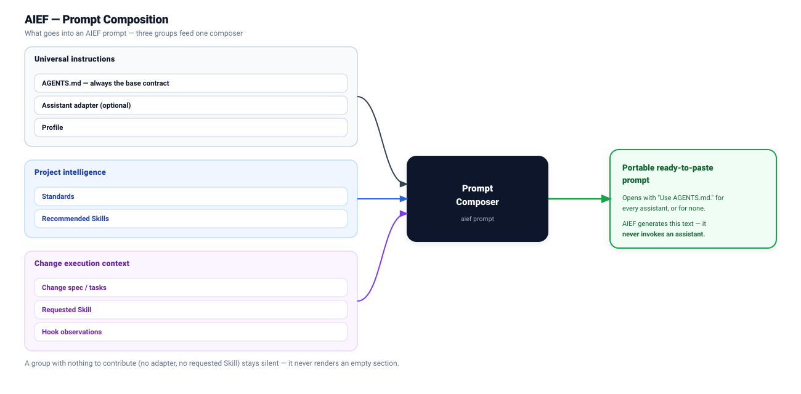
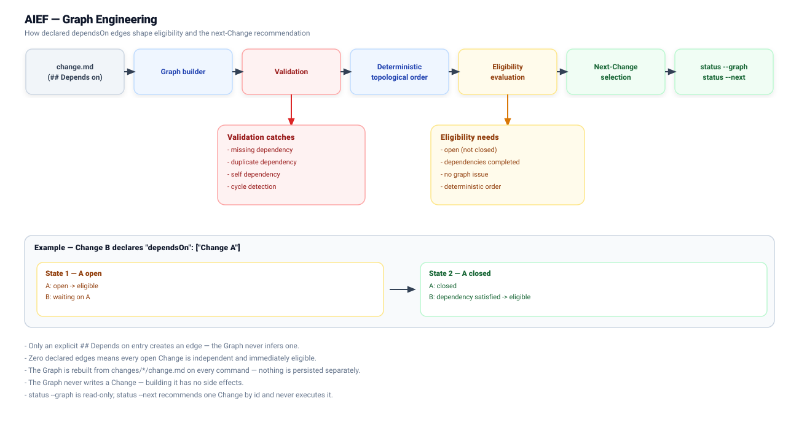

# Architecture

The implemented architecture, as it exists today. There is no daemon, no database, no hidden
state — the repository *is* the runtime state, and the CLI is a stateless function of the files on
disk each time it runs.

## Architectural principles

- **The repository is the source of truth.** No `.aief/` directory, no session state, no cache. A
  command re-derives everything it needs from files on disk every time it runs.
- **AIEF composes and verifies; it never implements.** No engine code writes application code,
  runs a test, or calls the network on your behalf.
- **The Change contract, not a workflow engine** (ADR-038). AIEF records scope, evidence and human
  decisions and checks them deterministically; assistants supply workflow mechanics.
- **Recommendation, never execution.** Anything that looks like automation (`status --next`, a
  Hook's observation) prints a suggestion or a fact; nothing in the engine re-invokes a command,
  an assistant, or itself.
- **One implementation per concept.** A domain model owns a shape, a service owns the one
  orchestration of it, a registry maps an id to an implementation — never duplicated per caller.

## System context

Four zones, and one rule connecting them: AIEF reads and writes only the *visible* repository
state in the fourth zone — it never reaches into the execution environment directly.


AIEF reads and writes the files in **Visible repository state** — it never executes an assistant,
a test runner, or CI itself. `aief prompt` produces text a human pastes into an assistant; the
assistant, running independently in the **Execution environment**, modifies the project and writes
`evidence.md`. Test runners and CI produce evidence the same way, outside AIEF's control. Humans
retain scope, merge, and release authority throughout — AIEF never commits, opens a PR, or
approves anything.

## Core runtime architecture

Every subsystem follows the same four-layer split, top to bottom:



- **CLI Commands** — `doctor`, `bootstrap`, `prompt`, `verify`, `status`, `close`, and a handful of
  others. Each parses arguments, resolves the target Change, and renders output; none contains
  business logic of its own.
- **Application Services** — Next action, Prompt, Verification, Hooks, Graph/Next. Each is the
  single place a cross-cutting concern is orchestrated; a command never re-implements what a
  service already does.
- **Domain Models** — Change, Requirement, Skill, Hook, Graph. Pure shape and validation,
  no I/O beyond parsing a string it's handed.
- **Registries / Providers** — Skills, Hooks, Requirement providers. Static, statically-imported maps from id to implementation — adding one
  means adding a file and a registry entry, never touching a caller.
- **Repository** — Change files, knowledge, config, evidence. The actual state; every layer above
  is a stateless function over it.

| Layer | Responsibility | Where |
|---|---|---|
| CLI Commands | Argument parsing, Change resolution, output rendering | `cli/bin/aief.js`, `cli/src/cli.js` |
| Application Services | Next action, Prompt, Verification, Hooks, Graph/Next orchestration | `cli/src/core/services/*.js` |
| Domain Models | Change, Requirement, Skill, Hook, Graph shapes | `cli/src/core/domain/change.js`, `skill.js`, `hook.js`, `change-graph.js` |
| Registries / Providers | Static id-to-implementation maps | `skills/`, `hooks/`, `requirement-providers/` |
| Repository | The actual state read/written every run | `changes/`, `knowledge/`, `evidence.md` |

## Change lifecycle data model

A Change is a directory (`changes/<id>-<slug>/`) of plain files: `change.md`, `spec.md`,
`tasks.md`, `evidence.md`. `change.js` derives everything about a Change — open/closed, type,
evidence placeholder-or-not, open task count, approval lines, `## Depends on` — by reading those
files directly, never from a separate index. `checkChangeReadiness()` (`change-verifier.js`) is the
one readiness rule `close` applies, and `next-action.js` turns it into the single "what's next" that
`status`, `prompt`, the verify Hook and Skills share.

## Prompt composition

`aief prompt` is the only place context is composed into one prompt — no source file references
another. Three groups feed the composer; a group that doesn't apply stays silent rather than
producing an empty section.



`AGENTS.md` is always the base contract — every generated prompt opens with "Use AGENTS.md." first,
regardless of assistant. An assistant adapter (`CLAUDE.md`, `GEMINI.md`, ...) only ever adapts
tone and phrasing, never contradicts it, and is entirely optional: a project with none still gets a
complete prompt. Every other block is additive; a Change with no Skill request produces output
identical to a project that never adopted that feature.
AIEF generates this prompt as text — it never calls an assistant's API or invokes it directly.

## Verification and evidence

`aief verify` runs **Structural Verification**: are the Change's required files present, is
evidence more than a placeholder, how many tasks remain open. `--strict` adds objective
completeness checks, including unchecked `(human)`/`(review)` approvals in `tasks.md` or in
`spec.md`'s Acceptance Criteria. Results are deterministic — never AI-judged, never a live test
execution. `aief close --evidence-from <junit.xml>` records an existing test report's counts in
`evidence.md`; AIEF never runs the tests itself.

## Graph Engineering and next-Change selection

A Change lists the Changes it depends on under `## Depends on` in its own `change.md` (ADR-038).
The Graph is derived fresh from disk on every command — nothing is persisted beyond `change.md`.



The Graph is **read-only**: `change-graph.js` exports one pure function, `buildGraph(nodes)`, with
no filesystem access of its own — `commands/shared.js` gathers real Changes and hands them in. It
never writes a Change and is rebuilt from scratch every invocation, so it can never drift from
what's actually on disk.

`status --next` **recommends only** — it never executes, re-prompts, or advances anything. A
Change is eligible when it is open, every dependency exists and is closed, and it isn't part of a
cycle; the lowest Change id wins ties. With no declared dependency anywhere in a project, every
open Change is independent and immediately eligible — **only an explicit `## Depends on` entry
creates an edge; the Graph never infers one.** `close` prints a notice, never a block, while a
dependency is open.

Example:

```markdown
<!-- changes/0002-add-payments/change.md -->
## Depends on

- 0001-user-model
```

Change `0002` is not eligible until Change `0001` is closed — `aief status --graph` shows the edge
and the topological order; `aief status --next` explains the block by name.

Analysis 0154 found real projects naming dependencies in prose in 12 of 92 Changes, which is why the
Graph was kept and moved into `change.md` when the manifest was removed.

## Extension model

Every registry is a plain, statically-imported object — there is no plugin loader. Adding a Skill,
Hook, or Requirement provider means adding one file and one
registry entry, never touching a caller.

- **Skills** (`skill.js`, `skills/index.js`, `skill-service.js`) — a closed capability vocabulary
  and a seven-status result contract; `writeFiles`, `executeCommands`, and `network` cannot be
  declared `true` by any Skill this release, so a Skill attempting to register with one fails
  registration outright.
- **Hooks** (`hook.js`, `hooks/index.js`, `hook-service.js`) — the same descriptor discipline, fired
  on a closed two-event catalog (`prompt.prepared`, `verify.completed`); a Hook has no path back
  into the exit code or file state at all — purely observational by construction.

## Deliberate boundaries

- No hidden `.aief/` directory, state file, or database.
- No spec generation inside AIEF's own core — a human or the assistant owns that.
- No vendored SpecBoot files — inspiration only, never copied.
- No assistant-specific logic in the engine — differences end at the instruction-file name.
- No technology-specific knowledge in engine code — it lives in the Skill Catalog (`detect.js`,
  `skills-catalog.json`).
- No plugin loader — every registry is static, reviewed, and statically imported.
- No blocking authority for Hooks or the Graph — both are non-blocking by construction, not merely
  by convention.
- No automatic execution anywhere — `status --next` recommends, a Hook observes; nothing in the
  engine re-invokes a command, an assistant, or itself.
- No workflow engine, tracks or per-Change manifest (ADR-038).

## Implementation map

| Concept | Files |
|---|---|
| CLI dispatch | `cli/bin/aief.js`, `cli/src/cli.js` |
| Change model | `change.js` |
| Next action | `next-action.js` |
| Skills Runtime | `skill.js`, `skills/index.js`, `skill-service.js`, `skill-context.js` |
| Hooks Runtime | `hook.js`, `hooks/index.js`, `hook-service.js`, `hook-context.js` |
| Graph & next-Change selection | `change-graph.js`, `next-change-service.js` |
| Verification | `change-verifier.js` |
| Prompt composition | `commands/prompt.js` |
| Detection / Skill Catalog | `detect.js`, `skills-catalog.json` |
| Bootstrap & distribution | `cli/bin/aief.js`, `cli/templates/` |
