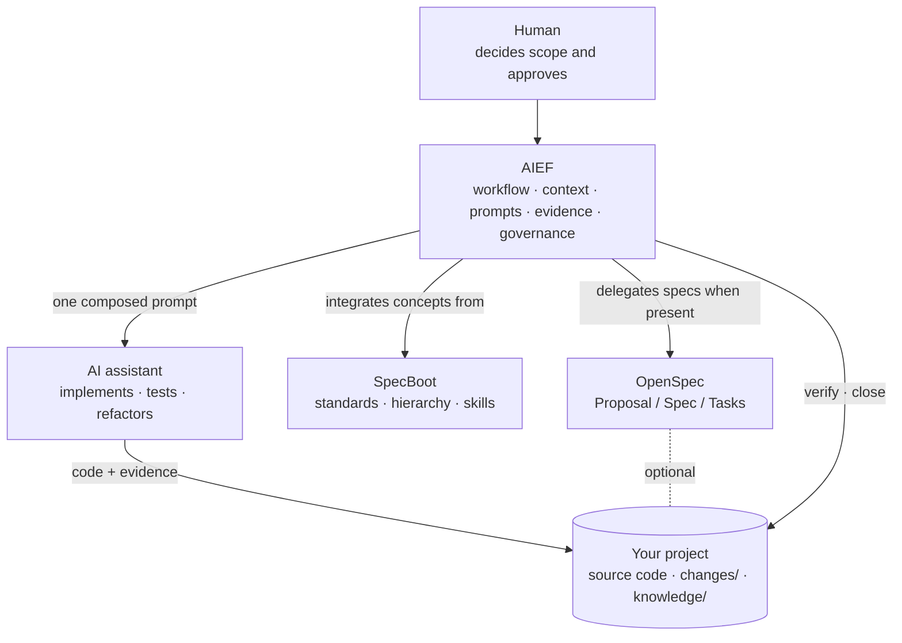

# The AIEF Ecosystem

> Who owns what when humans, AIEF, OpenSpec, SpecBoot and AI assistants work on one project. Supersedes `docs/tooling.md`.

AIEF is an orchestrator in an ecosystem of specialized tools. Every integration is **optional**: AIEF works standalone, detects what is present, and announces every fallback explicitly — never silently.

## Responsibility matrix

| Component | Responsibility | Never does |
|---|---|---|
| **AIEF** | Workflow, context, prompt composition, evidence, verification, Change lifecycle, project adoption, bootstrap | Generate specs, implement code, commit, archive another tool's artifacts |
| **OpenSpec** *(optional)* | Proposal, Specification, Tasks | Adoption, evidence, Change governance |
| **SpecBoot** *(conceptual source)* | Origin of the standards / instruction-hierarchy / skills concepts that AIEF integrated | Nothing at runtime — no files copied, no dependency ([ADR-003](../knowledge/decisions.md)) |
| **AI assistant** *(any)* | Code implementation, refactoring, code generation, tests, local reasoning | Approve scope or releases |
| **Source code** | The project itself — application code and tests | — (AIEF never touches it) |
| **Humans** | Scope, trade-offs, architecture decisions, release readiness | — (nothing replaces this) |

## How each relationship works

### AIEF ↔ OpenSpec

OpenSpec is the preferred engine for Proposal → Spec → Tasks ([ADR-002](../knowledge/decisions.md)). The verified official workflow (Explore → Propose → Apply → Archive) runs through assistant slash commands (e.g. `/opsx:propose`) — level 2 of the [workflow](Workflow.md).

- `aief propose "<idea>"` validates the OpenSpec contract at runtime (installed? version? `propose` exposed?) and delegates when possible; on any failure it announces the fallback and creates a local Change skeleton — the local path is the normal path, not a degradation.
- `aief doctor` reports OpenSpec as **recommended** with the install command when absent.
- `aief close` and OpenSpec `/archive` govern different artifacts; if you use both, do both ([comparison](Workflow.md#aief-close-vs-openspec-archive)).
- Contract details: [adapters/openspec/](../adapters/openspec/README.md).

### AIEF ↔ SpecBoot

SpecBoot (LIDR) solves assistant-instruction organization; AIEF integrated its *concepts*, not its files ([ADR-003](../knowledge/decisions.md), [ADR-010](../knowledge/decisions.md)):

- modular standards → editable files under `knowledge/standards/`, created by `aief adopt`;
- instruction hierarchy → `AGENTS.md → assistant file → profile → standards → skills → active Change`;
- skills → catalog-driven contextual knowledge in prompts.

In an adopted project **AIEF owns these artifacts**; SpecBoot remains an external tool a team may also use. `aief doctor` and `aief init` detect and report it, nothing more. Mapping: [adapters/specboot/](../adapters/specboot/README.md).

### AIEF ↔ AI assistants

Strictly assistant-agnostic: Claude, Gemini, Codex and Cursor are supported identically (`aief prompt <assistant>` selects `CLAUDE.md` / `GEMINI.md` / `CODEX.md` / `CURSOR.md`); Copilot, ChatGPT or any future assistant work with the same generated prompt. No assistant-specific commands exist, and none ever will as core logic — per-assistant support is an adapter concern. `doctor` lists detected assistants as **optional**, all equal.

### AIEF ↔ your source code

AIEF's hardest guarantee: it never modifies application code. `init`, `adopt` and `analyze` write only AIEF workflow files; `doctor`, `status`, `prompt`, `verify` write nothing; `close --yes` writes one Status section in the Change's own file. The assistant — directed by the human — is what changes source code.

## One picture

## Choosing your stack

| You have | You get |
|---|---|
| AIEF alone | Full workflow: local Change skeletons, prompts, evidence, governance |
| AIEF + OpenSpec | Formal Proposal/Spec/Tasks via the assistant; AIEF governs the Change |
| AIEF + SpecBoot practices | Team conventions maintained with SpecBoot tooling; AIEF consumes the same visible files |
| AIEF + any assistant | Identical workflow; only the instruction file changes |

Start with the smallest stack that works and add tools when a real friction demands them ([ADR-008](../knowledge/decisions.md)).
