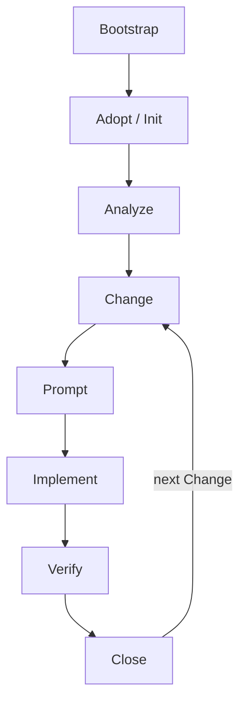

# The AIEF Project Lifecycle

> Stage-by-stage view of a project's life with AIEF: who is responsible, what goes in, what comes out. The three-level model behind these stages is canonical in [Workflow.md](Workflow.md); this document supersedes `docs/project-lifecycle.md`.



## Stages

### 1. Bootstrap — get AIEF working

| | |
|---|---|
| **Responsible** | AIEF (`npm install` + `npm link`, `aief doctor`) |
| **Inputs** | A machine with Node >= 18, git; optionally OpenSpec, SpecBoot, build tools, assistants |
| **Outputs** | A working `aief` command; a doctor report grouping tools by level (required / recommended / optional) |

Details: [bootstrap.md](bootstrap.md). Missing optional tools never block; missing required tools are named explicitly.

### 2. Adopt / Init — bring AIEF into the project

| | |
|---|---|
| **Responsible** | AIEF (`aief init` in the current directory, or `aief adopt`; `aief init <name>` for greenfield) |
| **Inputs** | The existing repository (README, package files, docs — read for detection) |
| **Outputs** | `AGENTS.md` (if missing), `changes/` with the adoption Change (evidence auto-generated), `knowledge/standards/` starters matched to the stack, `knowledge/skills.md`, `profiles/` |

Guarantees: never touches application code, never overwrites, idempotent ([ADR-005](../knowledge/decisions.md)). OpenSpec/SpecBoot absence is reported with guidance, not installed.

### 3. Analyze — understand before changing

| | |
|---|---|
| **Responsible** | AIEF creates the Analysis Change (`aief analyze`); the assistant + human perform the analysis |
| **Inputs** | Everything doctor detects: signals, recommended Skills, available standards, inferred risks |
| **Outputs** | `changes/<id>-analyze-current-architecture/` seeded with Detected Context (marked as inference, to confirm or discard); later its completed `evidence.md` |

Analysis Changes never modify source code — the generated prompt enforces this.

### 4. Change — define the unit of work

| | |
|---|---|
| **Responsible** | Human defines scope; AIEF creates the skeleton (`aief new-change`, `aief propose`); OpenSpec generates formal Proposal/Spec/Tasks when present |
| **Inputs** | An idea or requirement |
| **Outputs** | `changes/<id>-<slug>/` with `change.md`, `spec.md`, `tasks.md`, `evidence.md` (template) — or OpenSpec's artifacts when delegation succeeds |

### 5. Prompt — compose the context

| | |
|---|---|
| **Responsible** | AIEF Prompt Engine (`aief prompt [assistant] [--profile X]`) |
| **Inputs** | AGENTS.md, assistant file, profile, `knowledge/standards/`, Skill content, the active Change |
| **Outputs** | One ready-to-paste prompt with scope, reading list, standards, Skills-as-context and lifecycle guardrails. Writes nothing |

### 6. Implement — the engineering work

| | |
|---|---|
| **Responsible** | **AI assistant**, directed by the human (level 2 — AIEF does not participate) |
| **Inputs** | The composed prompt; the repository; optionally OpenSpec slash commands (Explore → Propose → Apply → Archive) |
| **Outputs** | Source code, tests, docs — and the Change's `evidence.md` completed with what actually happened |

### 7. Verify — check the structure and evidence

| | |
|---|---|
| **Responsible** | AIEF (`aief verify`), read-only |
| **Inputs** | `README.md`, `AGENTS.md`, every `changes/<id>/` directory |
| **Outputs** | PASS/FAIL report: missing/empty files, placeholder evidence (calm for open Changes, warning for closed ones), next recommended step |

### 8. Close — govern the outcome

| | |
|---|---|
| **Responsible** | AIEF checks readiness (`aief close`); the **human** confirms (`--yes`) |
| **Inputs** | The active Change's files: change.md, tasks.md, evidence.md |
| **Outputs** | A dated `## Status / Closed` section in the Change's own `change.md` — the only write of the governance level. The next open Change becomes active automatically |

Closing in AIEF does not archive in OpenSpec, and vice versa — each tool governs its own artifact.

## The knowledge loop

Across Changes, the project accumulates visible knowledge — that is the point of the loop:

```text
Project -> Change -> Evidence -> Knowledge -> next Change
```

Evidence captures what happened; `knowledge/` (decisions, standards, skills, lessons) captures what should be remembered. Every completed Change should make the project easier to understand — and gives the next Change better context to start from.
