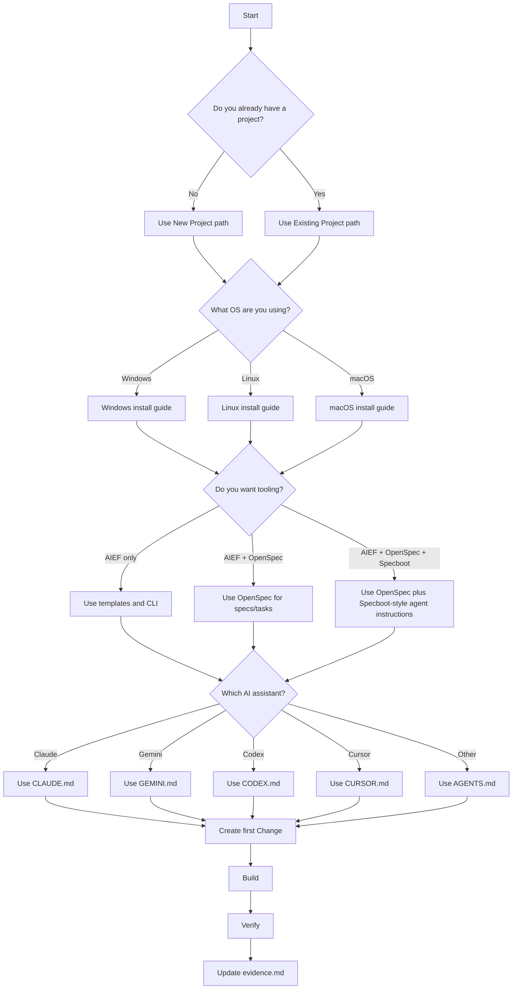

# Decision Tree

Use this page to choose the right path.

## Read Next

- New project: [new-project.md](new-project.md)
- Existing project: [existing-project.md](existing-project.md)
- Tooling: [tooling.md](tooling.md)
- AI assistants: [ai-assistants.md](ai-assistants.md)
