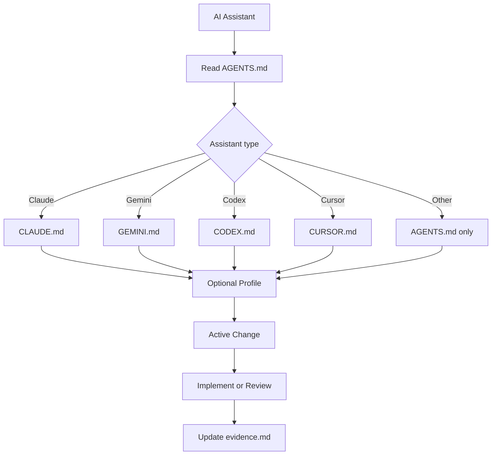

# AI Assistant Diagram

```mermaid
flowchart TD
    A[AI Assistant] --> B[Read AGENTS.md]
    B --> C{Assistant type}
    C -->|Claude| D[CLAUDE.md]
    C -->|Gemini| E[GEMINI.md]
    C -->|Codex| F[CODEX.md]
    C -->|Cursor| G[CURSOR.md]
    C -->|Other| H[AGENTS.md only]

    D --> I[Optional Profile]
    E --> I
    F --> I
    G --> I
    H --> I

    I --> J[Active Change]
    J --> K[Implement or Review]
    K --> L[Update evidence.md]
```
