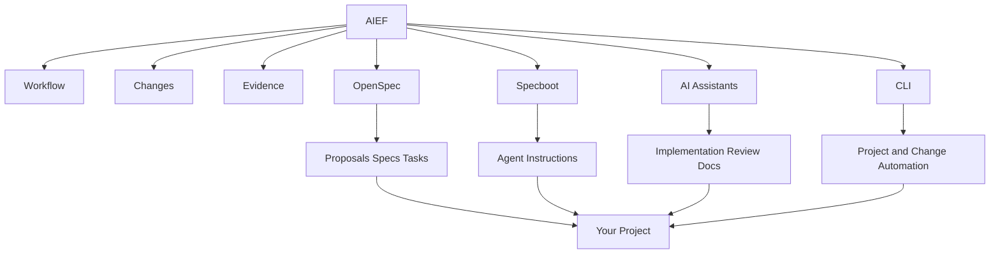

# Ecosystem Diagram

```mermaid
flowchart TD
    A[AIEF] --> B[Workflow]
    A --> C[Changes]
    A --> D[Evidence]

    A --> E[OpenSpec]
    A --> F[Specboot]
    A --> G[AI Assistants]
    A --> H[CLI]

    E --> I[Proposals Specs Tasks]
    F --> J[Agent Instructions]
    G --> K[Implementation Review Docs]
    H --> L[Project and Change Automation]

    I --> M[Your Project]
    J --> M
    K --> M
    L --> M
```
