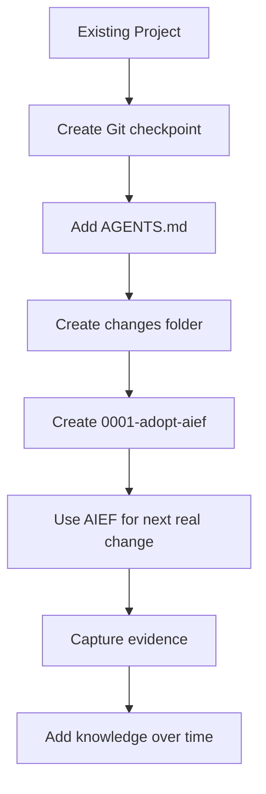

# Existing Project Diagram

```mermaid
flowchart TD
    A[Existing Project] --> B[Create Git checkpoint]
    B --> C[Add AGENTS.md]
    C --> D[Create changes folder]
    D --> E[Create 0001-adopt-aief]
    E --> F[Use AIEF for next real change]
    F --> G[Capture evidence]
    G --> H[Add knowledge over time]
```
