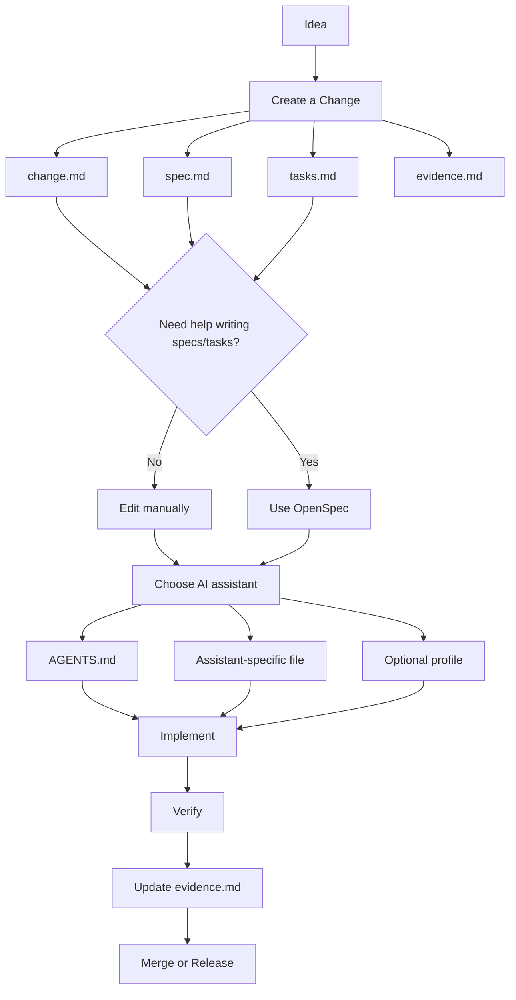

# Mental Model Diagram

```mermaid
flowchart TD
    A[Idea] --> B[Create a Change]
    B --> C[change.md]
    B --> D[spec.md]
    B --> E[tasks.md]
    B --> F[evidence.md]

    C --> G{Need help writing specs/tasks?}
    D --> G
    E --> G

    G -->|No| H[Edit manually]
    G -->|Yes| I[Use OpenSpec]

    H --> J[Choose AI assistant]
    I --> J

    J --> K[AGENTS.md]
    J --> L[Assistant-specific file]
    J --> M[Optional profile]

    K --> N[Implement]
    L --> N
    M --> N

    N --> O[Verify]
    O --> P[Update evidence.md]
    P --> Q[Merge or Release]
```
