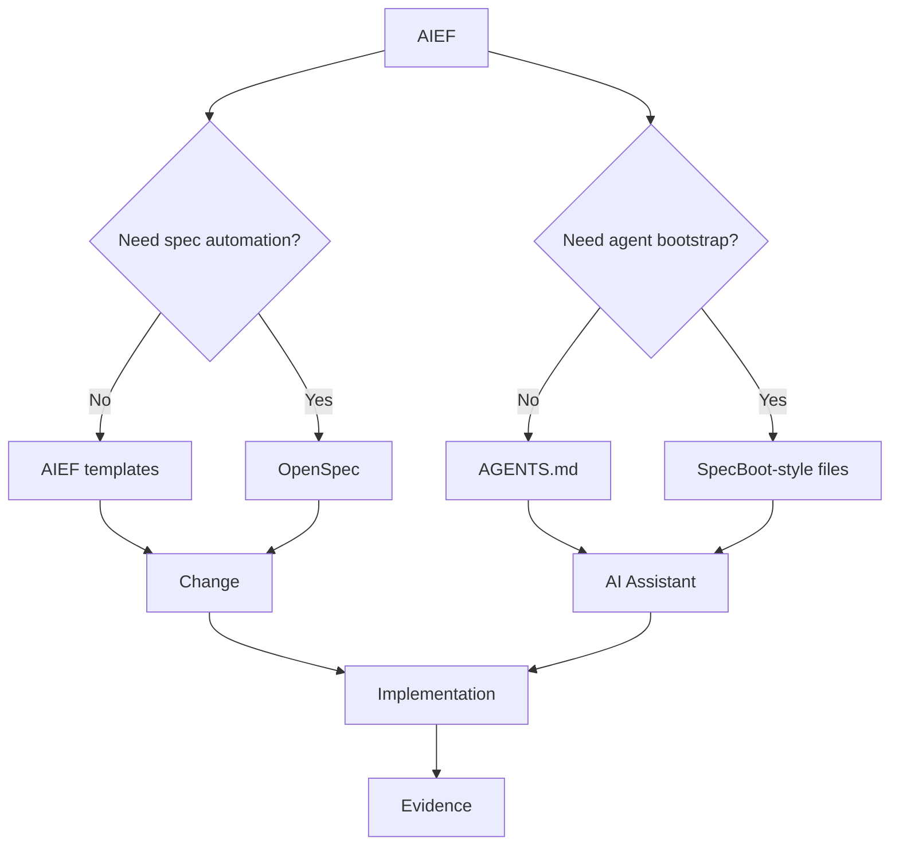

# Tooling Diagram

```mermaid
flowchart TD
    A[AIEF] --> B{Need spec automation?}
    B -->|No| C[AIEF templates]
    B -->|Yes| D[OpenSpec]

    A --> E{Need agent bootstrap?}
    E -->|No| F[AGENTS.md]
    E -->|Yes| G[SpecBoot-style files]

    C --> H[Change]
    D --> H
    F --> I[AI Assistant]
    G --> I

    H --> J[Implementation]
    I --> J
    J --> K[Evidence]
```
