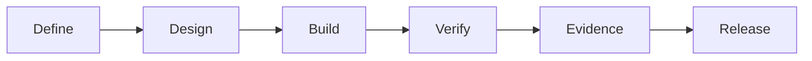

# Workflow Diagram

## Meaning

- Define: clarify the Change.
- Design: decide how to implement.
- Build: make the change.
- Verify: check acceptance criteria.
- Evidence: capture proof.
- Release: approve and publish.
