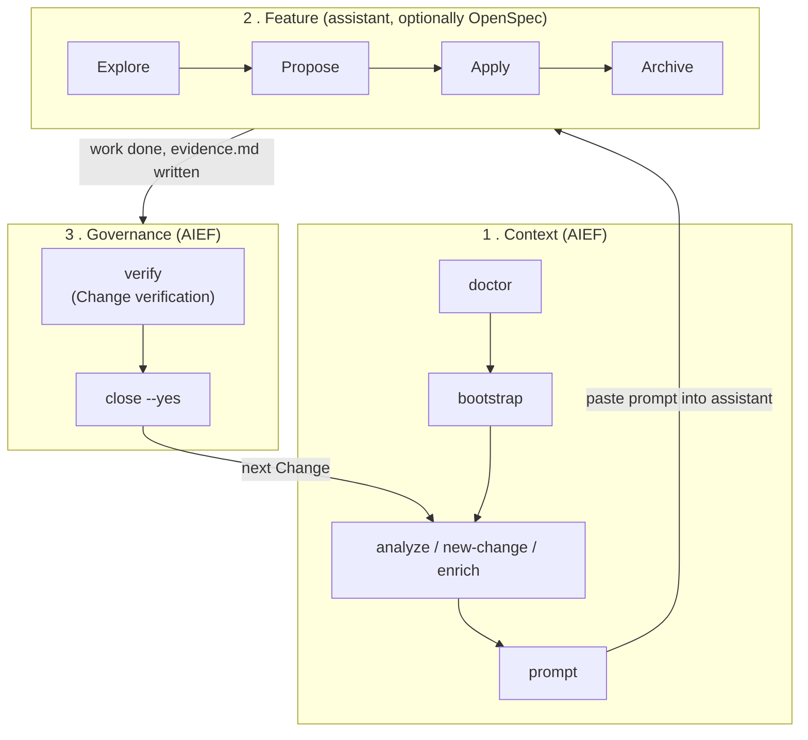

# Workflow

The canonical description of how AIEF, OpenSpec, and your AI assistant work together, and how a
Change moves from idea to closed. Vocabulary used here (Change, Track, Gate, Skill, Hook,
Verification Rule) is defined in [Concepts](concepts.md).

## The three levels



- **Level 1 — Context.** AIEF prepares the ground: `doctor` checks environment and project
  readiness (not a Change's own `verify`), `bootstrap` adopts an existing project without touching
  application code, then a Change is created and a context-complete prompt is composed. This level
  never implements functional code.
- **Level 2 — Feature.** The engineering itself, done by your AI assistant, optionally structured
  by OpenSpec (Explore → Propose → Apply → Archive). AIEF does not implement, generate specs, or
  duplicate this level.
- **Level 3 — Governance.** AIEF checks the result and closes the loop: `verify` reports a
  specific Change's structure and (optionally) requirement compliance; `close --yes` marks that
  Change Closed.

A Change that opts into a `track` (see [Tracks](#tracks)) gets additional stage/gate narration
inside levels 1 and 3, but the three-level shape never changes.

## The Change lifecycle end to end

```text
Idea, or an external Requirement Source (Jira, manual, ...)
  -> aief new-change / analyze / enrich        (level 1: create the Change)
  -> [enrich only] Human Review required before continuing
  -> aief propose [--change <id>]              (new idea, or continue an enriched Change)
  -> aief prompt -> assistant works            (level 2: implementation)
  -> evidence.md completed
  -> aief verify [--requirements]              (level 3: structural + optional requirement check)
  -> aief close --yes                          (level 3: Change marked Closed)
  -> aief status --next                        (what to do next)
```

## Tracks

A Change with no `manifest.json`, or a manifest with no `track`, follows the classic path above —
untouched, and that is the vast majority of Changes. Declaring a `track` in `manifest.json` adds a
named sequence of stages and gates that `aief status` narrates:

| Track | Stages | When to use |
|---|---|---|
| `lite` | work → verify → close | Small, low-risk changes — a docs fix, a small bugfix. |
| `standard` | work → verify → review → close | The common case — a feature that benefits from an independent review before closing. |
| `governed` | approval → work → verify → security_review → review → close | High-risk or compliance-sensitive changes that need sign-off before work starts and a dedicated security pass before review. |

Each stage may declare a `gateIds` list. A **gate** is `pending` until satisfied, then `passed`; an
unsatisfied gate on the current stage is a **blocker** — `aief status --change <id>` always shows
blockers separately from merely-pending gates, and never reports a transition as available while a
gate blocks it. Gates are read-only narration: nothing in AIEF auto-advances a stage or waits on a
gate to unblock a command. `aief close` still runs its own readiness checks regardless of track.

### Checking where a Change stands

```bash
aief status --change 0002-add-login          # deep view: track, stage, gates, SDD readiness
aief status --change 0002-add-login --next   # compact view: the one next action to take
aief status --next                           # same, with exactly one open Change
```

## Starting from a Requirement Source

Real work often starts in a ticket, not in `aief new-change`. `aief enrich <provider>
<source-id>` reads a requirement **read-only** — AIEF never writes back to Jira or any other
system — and creates a Change seeded with it, classified as Fact `[H]` / Inference `[I]` /
Assumption `[S]`, with a `Requires Human Review` status:

```bash
aief enrich manual TEST-001
aief enrich jira ISSUE-123 --file requirements/jira/ISSUE-123.json   # local export, no network
```

`aief close --yes` refuses this Change until every Human Review task is checked off by a human —
an assistant must never check one itself. Once reviewed, `aief propose --change <id>` continues the
**same** Change (adds `proposal.md`, never forks a new one), or go straight to `aief prompt`. Only
`manual` and `jira` (local-export) are implemented today; Notion, GitHub Issues and Azure DevOps
are defined in the same contract but not yet built — requesting one fails loudly, never silently.

## Skills Runtime

`aief prompt --skill <id>` attaches one registered Skill's output to the generated prompt, after
every other context block. A Skill reports one of seven statuses; only `ready` carries real
instructions — every other status (`not_applicable`, `blocked`, `unsupported`, `completed`) is
rendered as one honest line, and `invalid`/`failed` stop the command before any prompt is printed.
List what's registered:

```bash
aief prompt --list-skills
```

Every shipped Skill is instructions-only: it hands the assistant guidance to follow, it never
writes a file, runs a command, or calls the network on its own — following the instructions is not
by itself evidence the described work happened.

## Harness — Hooks Runtime, visibility and configuration

**AIEF's Harness** is the Hook Runtime plus the opt-in configuration and logging layer over it
(Change 0056, ADR-026). Two lifecycle events exist today: `prompt.prepared` (fires at the end of
`aief prompt`, after every other context block) and `verify.completed` (fires after `aief verify`
has already printed its PASS/FAIL and set its exit code). A Hook observing either event can only
append an additional, clearly labeled section — it cannot influence the exit code, block the
command, or write a file itself. Hooks are internally registered, not user-authored — you cannot
define a new Hook via configuration, only see, disable, and log the existing ones.

`aief doctor --verbose` lists every registered Hook and the event it fires on (`aief doctor`'s
default output shows nothing about Hooks — this section only exists behind `--verbose`).

A Change's `manifest.json` may opt into Harness configuration:

```json
{
  "harness": {
    "log": true,
    "hooks": {
      "prompt.prepared": { "disabled": ["prompt-skill-suggestion"] },
      "verify.completed": { "disabled": [] }
    }
  }
}
```

- `harness.log: true` makes `aief prompt`/`aief verify --change <id>` append a visible, append-only
  `<changeDir>/hooks.md` record of every Hook's result for the fired event (id, event, status, a
  short summary — never raw command output or a credential, since Hooks structurally cannot
  produce either).
- `harness.hooks."<event>".disabled` excludes listed Hook ids from that event's output and log —
  the Hook is still evaluated (Hooks are pure and side-effect-free either way), only its result is
  excluded from what you see.
- `aief status --change <id>` shows a Harness section — only when the Change declares one —
  reporting configuration (which Hooks are active/disabled per event, any unknown-id warnings),
  never a fabricated execution count: `status` never fires a Hook, so it never claims one "passed".

No `harness` field (every Change before this one, and any Change that doesn't need it) behaves
exactly as before — `aief doctor` (default), `aief prompt`, `aief verify` are byte-identical.

## Loop — Verify, Feedback, Retry

**Loop** (Change 0057, ADR-027) is opt-in, per-Change attempt tracking over `aief verify --change
<id>`: **Verify → Feedback → Retry (if applicable) → Final result.** "Retry" names an outcome —
nothing in AIEF re-runs `verify`, an assistant, or any command automatically; a retry is always
the next manual `aief verify --change <id>` you (or an assistant, on your instruction) run.

```json
{
  "loop": {
    "verify": {
      "maxRetries": 3
    }
  }
}
```

- The current attempt number is derived from `<changeDir>/loop.md` itself (the count of prior
  attempts already logged, plus one) — never a hidden counter, never a `manifest.json` write.
- **Feedback** is exactly `aief verify`'s own Structural Verification error lines — nothing new is
  computed or fetched.
- The **outcome** is one of three states: `passed` (Loop complete), `retry_available` (still
  failing, under the limit — fix the items above and run `aief verify` again), or `exhausted`
  (failing at or beyond `maxRetries` — manual review required, `loop.md` has the full history).
  None of these ever changes `aief verify`'s own PASS/FAIL or exit code.
- `loop.verify` present with no `maxRetries` defaults to `3`.
- `aief doctor --verbose` lists every open Change with `loop.verify` configured and its current
  attempt count — read-only, never writes `loop.md` itself.

No `loop` field (every Change before this one) behaves exactly as before — `aief verify`
(whole-project and `--change`) and `aief doctor` (default and `--verbose`) are byte-identical, and
`loop.md` is never created. Loop does not gate `aief close` and has no `aief status --change`
section — `aief verify`'s own output and `loop.md` already answer every question a third surface
would only duplicate.

## Graph — the Change dependency model

A Change's `manifest.json` may declare `dependsOn`, naming other Changes it depends on (Change
0058, ADR-028). This is the **foundation** `aief status --next`'s smart selection (Change 0059,
below) builds on; automatic multi-step planning and Change navigation beyond picking one next
Change remain unimplemented.

```json
{
  "dependsOn": ["0002-user-model", "0003-add-login"]
}
```

`dependsOn` entries are Change directory basenames — the same identifier `--change <id>` already
accepts. Nothing is persisted beyond `manifest.json` itself: the graph is rebuilt, deterministically,
from `changes/*/manifest.json` on every invocation.

- **`aief status`** (overview) gains a "Dependency Graph:" section — present only when at least
  one Change declares `dependsOn` — listing each such Change's dependencies and any issues.
- **`aief status --graph`** renders the *full* graph: every Change as a node (even ones with no
  dependencies), every edge, the topological order (dependencies first), or an explicit
  "unavailable — dependency cycle among: ..." statement when a cycle exists.
- **`aief verify --change <id>`** prints one small, non-blocking note when the targeted Change has
  a Graph issue — never affects PASS/FAIL or the exit code.
- **`aief doctor`** is untouched — the Graph is cross-Change project state, which `status` already
  owns (the same place Workflow/SDD/Harness/Loop's own cross-Change facts live).

Issues detected, always as informational diagnostics, never as blockers:

| Issue | Meaning |
|---|---|
| `missing_dependency` | `dependsOn` names a Change that doesn't exist. |
| `self_dependency` | A Change lists itself in `dependsOn`. |
| `duplicate_dependency` | The same dependency is listed more than once. |
| `cycle` | Two or more Changes depend on each other, directly or transitively — no valid order exists among them. |

No `dependsOn` field anywhere (every Change before this one) behaves exactly as before —
`aief status` (overview), `aief verify` (whole-project and `--change`), and `aief doctor` are
byte-identical. `aief status --graph` is a brand-new flag.

## Smart next-Change selection — `aief status --next`

`aief status --next` (no `--change`) already had two paths (Change 0046): zero open Changes
(error), exactly one (shows that Change's compact Normalized Action — unchanged). **With two or
more open Changes, it now recommends one deterministically** instead of erroring (Change 0059,
ADR-029) — replacing the prior "select one explicitly" message for that case specifically.

A Change is **eligible** when all of:

1. it is open;
2. its manifest is valid (having none at all is fine — only an *existing*, invalid one disqualifies it);
3. every `dependsOn` entry names a Change that exists (no Graph `missing_dependency`/
   `self_dependency`/`duplicate_dependency` issue names it);
4. every dependency is **closed**;
5. it is not a member of a dependency cycle;
6. it has no unsatisfied Workflow gate blocker (a Change with no `track` trivially passes this).

**Loop and Harness are deliberately never consulted** — both are non-blocking by design
(ADR-026/027); using either here would silently give them authority those ADRs withheld.

When more than one Change is eligible, **the lowest Change id wins** (string-ascending comparison
— the same sort `buildGraph()`'s `nodes` and `status`'s own listings already use). This tie-break
never decides *eligibility* — only which already-equally-eligible Change to recommend.

```text
Next Change: 0002-add-login

Ready because:
- status: open
- dependencies: all closed (0001-user-model)
- graph: valid
- workflow: no blocking gates

Tie-break: lowest Change id, sorted ascending (...)
Other eligible Change(s): 0004-add-payments
```

When nothing is eligible, every open Change is listed with its own specific blocking reason —
never a bare "nothing found" — and the exit code is still `0` (an honest report, not an error).

No `dependsOn`/no relevant Graph or Workflow blockers, with exactly one or zero open Changes:
`aief status --next` is byte-identical to before Change 0059.

## Verification

`aief verify` always runs **Structural Verification** first: are the Change's required files
present, is the manifest (if any) consistent, is evidence classified as more than a placeholder, how
many tasks are still open. This is unconditional and unchanged regardless of any flag.

`aief verify --change <id> --requirements` additionally runs **Requirement Verification**: for
every requirement the Change's SDD artifacts declare, each applicable Verification Rule produces a
deterministic verdict grounded in already-produced evidence (an SDD artifact's own state, or a
file that must exist) — never AI, never a test execution, never a network call. Results aggregate
to one of `PASS`, `INCOMPLETE`, `FAIL`, `INVALID`, `ERROR` (fixed precedence, `ERROR` highest;
missing evidence is `INCOMPLETE`, never rounded up to `PASS`). A Change with no declared
requirements reports that honestly instead of a false pass.

Requirement Verification is informational this release: it does not feed into `aief close`'s
readiness check or into any Workflow gate. It is the report you read before deciding a Change is
really done — the machinery to make it load-bearing is deliberately not wired in yet.

## `aief close` vs OpenSpec `/archive`

They sound similar but govern different artifacts:

| | `aief close --yes` | OpenSpec `/archive` |
|---|---|---|
| Level | 3 — AIEF Governance | 2 — Feature Workflow |
| Acts on | The AIEF Change (`changes/<id>/change.md`) | The OpenSpec change (`openspec/changes/<name>/`) |
| Checks | Files present, tasks checked, evidence complete | OpenSpec's own workflow state |
| Writes | A dated `## Status / Closed` section | Moves the change into OpenSpec's archive |

If you use both tools, do both — neither replaces the other.

## Responsibilities

| Actor | Responsibility | Never does |
|---|---|---|
| **AIEF** | Context, standards, Skills, prompts, evidence, governance, Workflow/SDD/Verification narration | Generate specs, implement code, commit, archive in OpenSpec |
| **OpenSpec** *(optional)* | Proposal → Spec → Tasks (Explore → Propose → Apply → Archive) | Project adoption, evidence, Change governance |
| **SpecBoot** *(conceptual source)* | Inspiration for standards and instruction hierarchy | Nothing at runtime — no files vendored, no dependency |
| **AI assistant** *(any)* | Implementation, refactoring, tests, review | Approve scope or releases |
| **Humans** | Scope, trade-offs, `(human)`/`(review)` approvals, release decisions | — |

## What AIEF does not do

- Generate proposals, specs or task content — OpenSpec or a human does.
- Implement, refactor, test or review code — the AI assistant does.
- Execute a Skill's instructions, run a command, or reach the network from a Skill or Hook.
- Keep hidden state — `change.md` / `manifest.json` are the only source of truth.
- Auto-advance a Workflow stage, unblock a gate, or mark `close` ready — those stay human/assistant
  decisions the CLI only reports on.
- Create commits, publish PRs, or approve releases.
